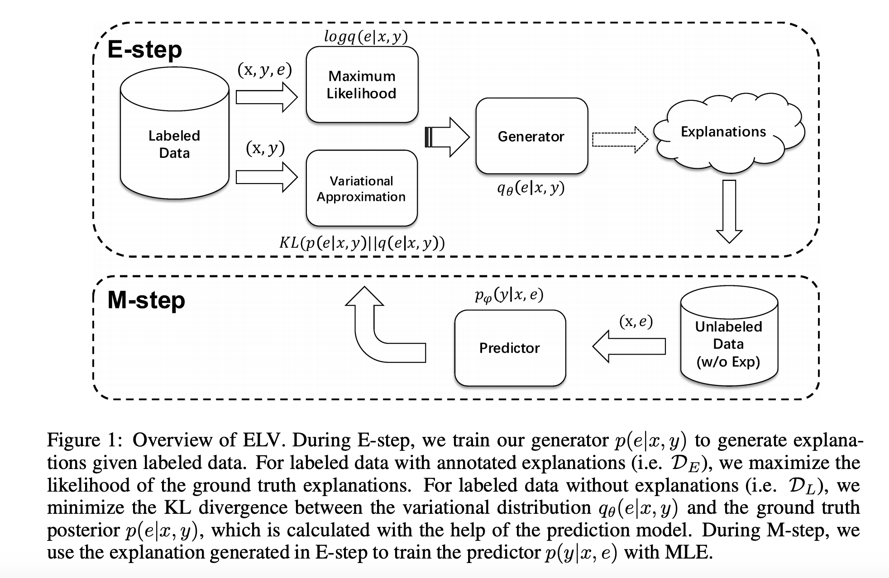

## Towards Interpretable Natural Language Understanding with Explanations as Latent Variables
### Zhou, Hu, Zhang, Liang, Sun, Xiong, Tang et al. 
### [[arXiv](https://arxiv.org/pdf/2011.05268.pdf)]

**Whats Unique**
A new framework where explnations considered as latent variables for underlying reasoning process of a neural model. That way, it can work with small dataset of human annotated explanations. Variational EM framework for optimisation enable an explanation generation module and explanation augmented prediction module. It also extend the framework where pesudo labels and explnations are iteratively generated and improves each other. 

**How It Works**
* ELV (Explanation as Latent Variable) Framework
    * Natural langauge explanations are treated as latent variable
    * Jointly trains explanation generation and explanation augmented prediction
    * ELV framework is being leveraged in semi-supervised learning, where for pseudo lables, explnations are generated iteratively. 
    * Emperical validation on tasks of relation extraction and sentiment analysis.

* Architecture Diagram
    

    
    <em>Source: Author</em>
    

* Formulation: We can formulate problem as the variational EM problem, 

    

* As we can notice, qθ(e|x, y), where θ is optimised in E-step. UniLM is used for generating explanations given x, and y.

* Whereas, φ in pφ(y|e, x) is optimised in M step. MLP over BERT contextual representation is used to predict the probability of the label. 

**Results**
* For both supervised, and semi-supervised settings, for both the tasks of relation extraction and sentiment analysis, this approach have given better results.

