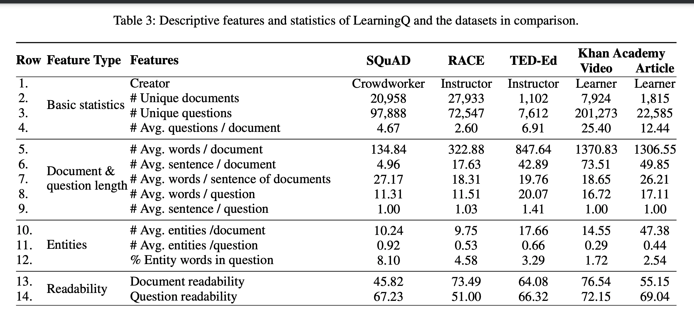
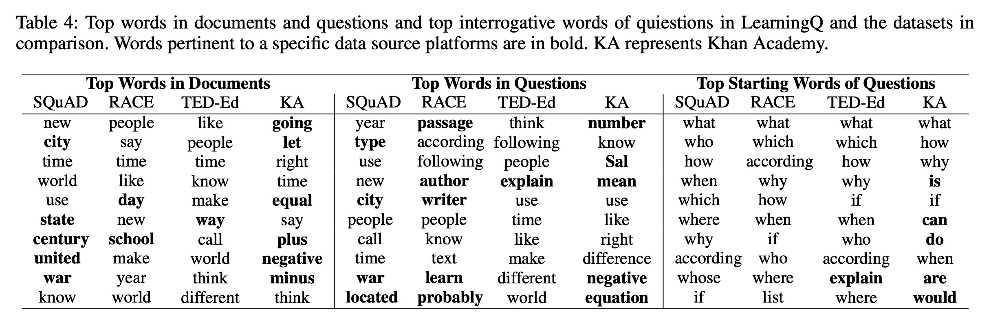
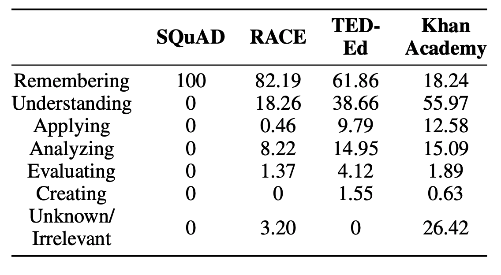
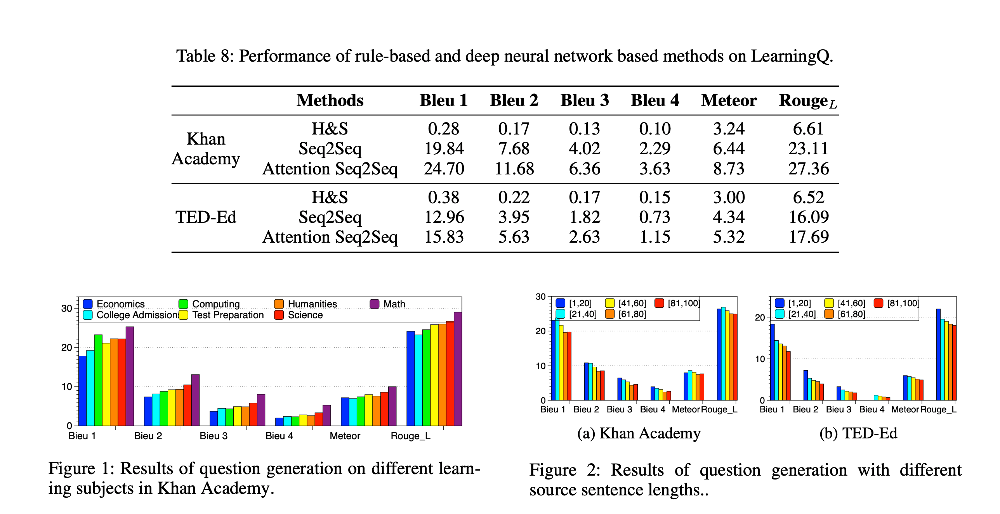

## LearningQ: A Large-scale Dataset for Educational Question Generation
### Guanliang Chen, Jie Yang, Claudia Hauff, Geert-Jan Houben
### AAAI 2018

**Whats New**
Its the question generation dataset containing 230K questions, where 7K questions are instructor generated and rest are learners generated. These questions caters to different bloom levels and subjects.

**Approach**
1. Data Collection from Three Sources
    * TedEd
    * Khan Academy Video
    * Khan Academy Articles
2. Data cleanup
    * Gathered total 953998 questions
    * Extracted sentences ending with "?": ~ 470K
    * 5600 questions were randomly selected, and given to expert to annotate - useful for learning or not.
3. Question Annotation & Classification
    * IAA Cohen's Kappa of 0.82 
    * 61.9% of annotated questions were useful for learning
    * 80% classification accuracy. 
    * 223K questions were selected.

* Analysis
1. Stats
    

    
    <em>Source: Author</em>
    

2. Top Words
    * Can be seen as follow
    

    
    <em>Source: Author</em>
    

3. Bloom Taxonomy
    * 200 questions were randomly selected from each dataset
    * Expert annotated with Blooms taxonomy
    * Cohen's Kappa agreement of 0.73
    * Results are as follow for those 200 questions for each dataset
    

    
    <em>Source: Author</em>
    

* Results
    * H&S overgenerate-and-rank approach, Seq2Seq model, and Seq2Seq model with attention were implemented, and results are as below:

    
    <em>Source: Author</em>
    

