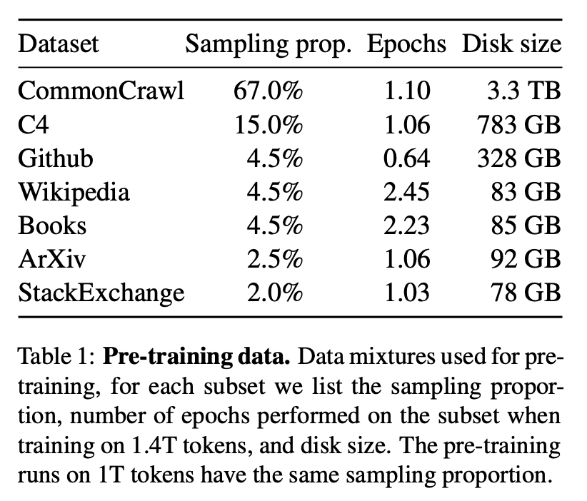
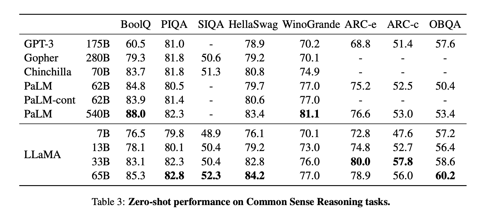
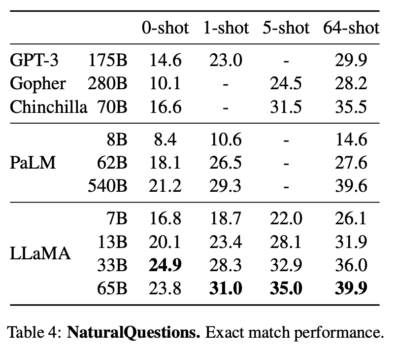

## Llama: Open and efficient foundation language models. 
### Touvron, Hugo, et al.
### arXiv preprint arXiv:2302.13971 (2023). [[arXiv](https://arxiv.org/pdf/2302.13971.pdf)]

**Whats New**

Llama is a new large language model (ranging from 7B to 65B parameters) from Meta, which is compute-efficient and has comparable performance to the models having 10 times more parameters. 

**Intuition**
- Hoffman (2022) put out scaling laws for LLMs, to determine how to best scale the dataset and model size for a particular training budget. However it has disregared the inference cost.
- The focus of Llama is to bring inference cost down, by training it on more tokens than generally used.
- Hoffman proposed around 200B tokens for 10B models, but Llama found out 7B model performance even gets better after 1T tokens.
- Core novelties were applied in the model training. 

**Technical Novelties**
- 1.4 tokens of only publicaly available data were used for pre-training, without any specific filtering. 

<em>Source: Author</em>

- Pre-normalisation (similar to GPT3) was used to improve training stability, instead normalising the output of transformer sub-layer.

- SwiGLU activation function (similar to PaLM) - activation function ReLU was replaced by SwiGLU, which uses dimension of 2/3 4d instead of 4d in PaLM.

- Rotary Embeddings (similar to GPTNeo) - absolute poisition embeddings were removed and rotary embeddings were used instead. 

- Efficient Implementation of causal multi head attention to reduce memory and runtime. Also, amount of activations required during forward and backward pass were reduced. 

**Evaluation**

Model was evaluated in zero-shot (task description and only one example) and few-shots (between 1 to 64 examples) modes. It was evaluated on wide variety of tasks and datasets, just pasting few for the comparision - CommonSense and NaturalQuestions.

 

    
    <em>Source: Author</em>
    

    
    <em>Source: Author</em>
    

    
It was also evaluated on Toxicity, Bias etc benchmark and the performance was comparative.

