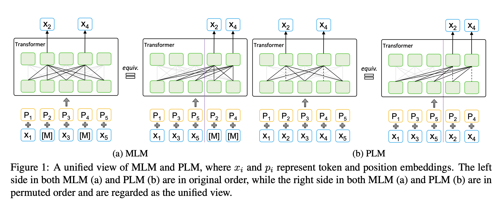
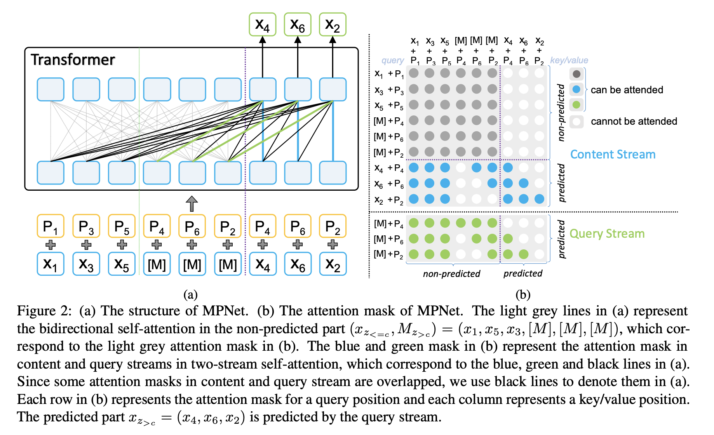

## MPNet: Masked and Permuted Pre-training for Language Understanding
### Kaitao Song, Xu Tan, Tao Qin, Jianfeng Lu, Tie-Yan Liu et al. 
### NIPS 2020 [[arXiv](https://arxiv.org/pdf/2004.09297.pdf)]

**Whats Unique**
This paper presents a new technique for pre-training which aims to fix weakness of BERT and XLNET. BERT neglects dependency among predicted tokens (Output Dependency), and XLNet does not leverage full positional information of a sentence (Input Descrepancy). MPNet proves to be the new state of the art.

**How It Works**
Following figure demonstrate the weakness of the BERT and XLNet model. 

    
    <em>Source: Author</em>
    

Following figure shows how MPNet address the weaknesses, and how it implements it by keeping query vector as well as content vector. Query vector will have positional information of yet to be predicted tokens, but content vector will also have token information.

    
    <em>Source: Author</em>
    

**Results**
It produce SOTA results on GLUE, Squad, RACE etc datasets.

