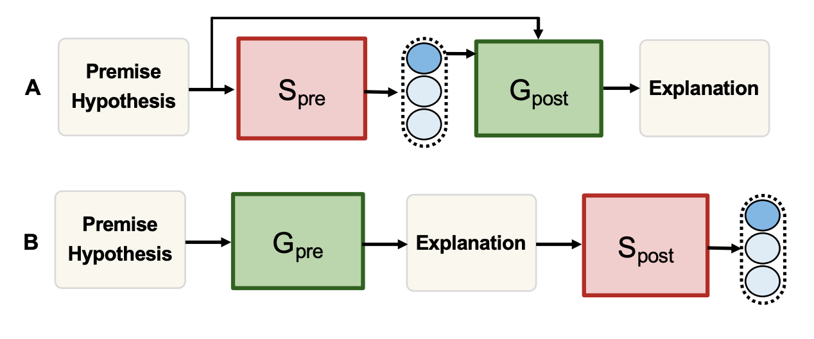
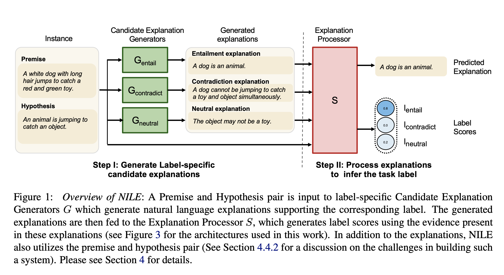
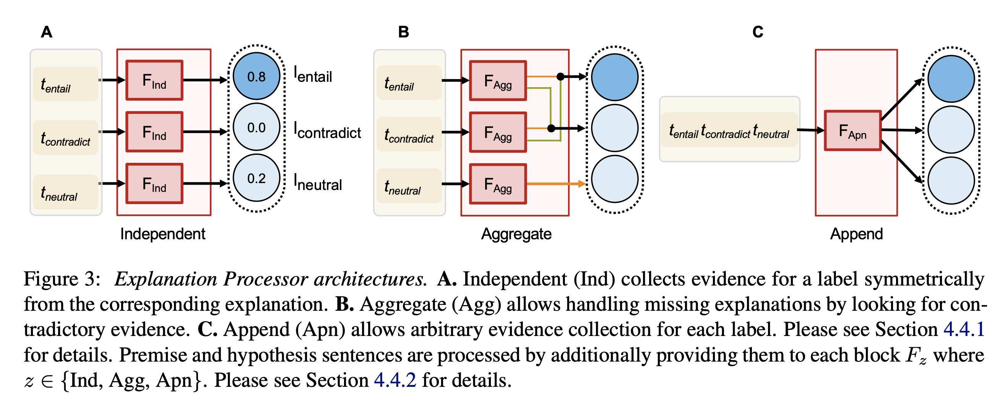

## NILE : Natural Language Inference with Faithful Natural Language Explanations
### Sawan Kumar, Partha Talukdar
### 2020, ACL

**Whats New** Generating explaination, in a faithful way, that they are integral part of decision making as well. 

**What are existing architecture alternatives** 
* Post-hoc generation: Given input instance, predict label first, and then generate explanation
* ExplainThenPredict: First generate explanation, and then predict the label

    

    
    <em>Source: Author</em>
    

** Overview of the system: NILE **
* NILE: Natural language Inference over Label specific Explanation
    

    
    <em>Source: Author</em>
    

* It has two modules
    * Explanation generator for each possible label
    * Explanation processor to predict the score processing lables

* NILE variants
    * Access to premise and hypothesis also with explanations
        * NILE-PH: It does not have access to premise and hypothesis
    * Access to label explanations to predict the score of that label
        * Independent: only access to the explanation of its label
        * Aggregate: Labels entail, and contradict access each other as well
        * Append: All explanations are appended

        

        
        <em>Source: Author</em>
        

    * Issue:
        * Explanation gives hint about task, and model directly learns it from premise and hypothesis. Which does not make it faithful.
        * Negative sampling is introduced to not make it obvious for model to learn it in above
        * NILE-NS: It does not have negative sampling

* Model Architecture:
    * LM Finetuning to generate explanation:
        * Training: "Premise: p Hypothesis: h [EXP] tg [EOS]"
        * Generation: "Premise: p Hypothesis: h [EXP]" is given, and CLM should generate the rest
        * These models are independent for each labels

    * Explanation processor has cross entropy loss over label prediction

**Results and takeaways**
* NILE with access to premise, hypothesis, and negative sampling has done much better, and its almost similar in performance with NILE:post-hoc, where explanations are produced in post hoc manner.
* NILE without negative sampling is not faitful, as sensitivity analysis reveals it.
* NILE-PH rely just on the explanation, that is interesting, and it is outperforming ETPA (e-SNLI: Natural Language Inference with Natural Language Explanations, Camburu 2018)
