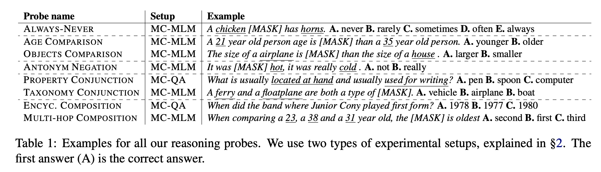
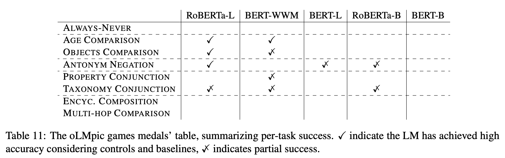

## oLMpics - On what Language Model Pre-training Captures
### Alon Talmor, Yoav Goldberg et al. 
### The Allen Institute for AI, 
### 2020 [[arXiv](https://arxiv.org/pdf/1912.13283.pdf)]

**Whats Unique**
This paper has designed knowledge probes for 8 different knowledge tasks and comparative study framework to undederstand pre-trained LM capabilities, and learning curve with fine tuning and control tasks with no language setting. 

**Tasks Considered for Knowledge Probes**

    
    <em>Source: Author</em>
    

**Methods**
* It uses MC-MLM and MC-QA method to probe models.
* MC-MLM: 
    * feed contextual representation of masked word in MC-MLM layer to predict the token l from vocaboarly
    * Take dot product of l over candidate words and take softmax to learn probability distribution.

        

* MC-QA: representation by passing contextual repre
    * Given a question q and candidate answers a1, . . . , aK, we compute for each candidate answer ak representations h(k) from the input tokens “[CLS] q [SEP] ak [SEP]”.

        

**Results**
Final findings are as below for Roberta and BERT models on 8 different knowledge tasks

    
    <em>Source: Author</em>
    

