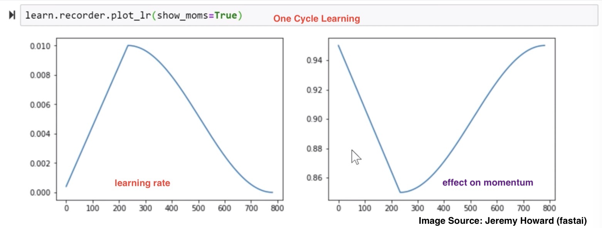
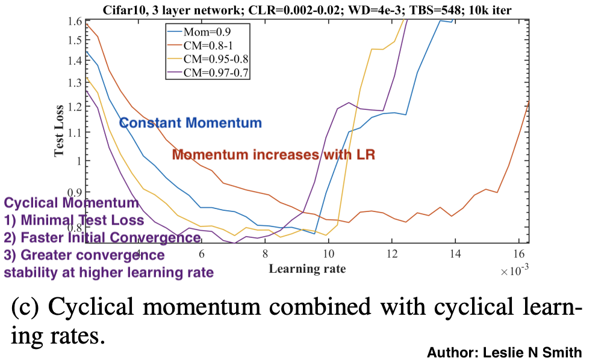

## A DISCIPLINED APPROACH TO NEURAL NETWORK HYPER-PARAMETERS
### Leslie N. Smith, April 2018

It shows how to examine the training validation/test loss function for subtle clues of underfitting and overfitting and suggests guidelines for moving toward the optimal balance point.
* Then it discusses how to increase/decrease the learning rate/momentum to speed up training.
* Weight decay is used as a sample regularizer to show how its optimal value is tightly coupled with the learning rates and momentum
* close attention to these clues while using cyclical learning rates and cyclical momentum.

Useful remarks:
* **Remark 1.** The test/validation loss is a good indicator of the network’s convergence
* **Remark 2.** The takeaway is that achieving the horizontal part of the test loss is the goal of hyperparameter tuning
* **Remark 3:** the amount of regularization must be balanced for each dataset and architecture. Smaller learning rates leads to overfitting, and higher weight decay leads to regularise. So, possible combinations: small LR with high WD, or high LR with small WD.

One cycle learning:
* Find a range of learning rate, i.e. LR before test loss starting to increase, and 3 (or 10) times lesser than that learning rate. 
* Use one cycle that is smaller than the total number of iterations and allow learning rate to decrease several orders of magnitude less than initial learning rate for the remaining iterations. 1cycle learning rate policy is a combination of curriculum learning (Bengio et al., 2009) and simulated annealing (Aarts & Korst, 1988). [[Blog](https://sgugger.github.io/the-1cycle-policy.html)] 

* **Remark 4:** One cycle leanring policy favours large batch size, and large batch size supports large learning rates as well. i.e. batch size should not be compared with iterations or epoch, but the fair comparision would be wrt time.

* **Remark 5:** Cyclical momentum, where decreases in momentum with increase in learning rate is proven to be effecive for convergence

* **Remark 6:** Cyclical weight decay is not useful, and experiments shows that it should remain constant through out training. Gridsearch is worthwhile for finding WD value. The the amount of regularization must be balanced for each dataset and architecture.  

**Final Recipe:**
* *Learing Rate*: LR test, and hence One Cylce LR Approach
* *Batch Size*: Large batch size is recommended with One Cycle Learning, which would support large LR
* *Momentum*: Short run with momentum 0.99, 0.97, 0.95, and 0.9 will quickly show its impact. Cyclical Momentum with One Cycle LR approach
* *Weight Decay*: Requires grid search (i.e. typically between 10-3, 10-4, 10-5, 0 etc). Smaller datasets and architecture requires larger WD value, whereas larger dataset and complex architecture requires smaller WD value

