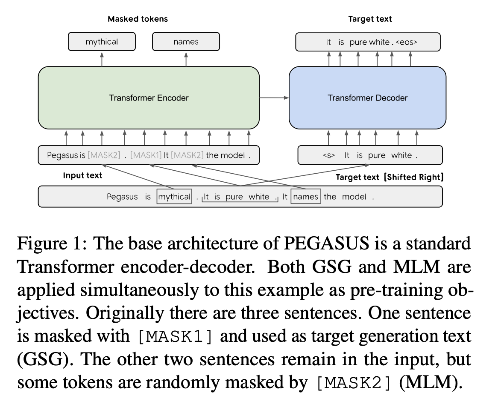

## PEGASUS: Pre-training with Extracted Gap-sentences for Abstractive Summarization
### Jingqing Zhang, Yao Zhao, Mohammad Saleh, Peter J Liu
### Google Research
### ICML 2020

**Whats New** This paper presents a pre-training objectives and design decisions for downstream tasks of abstractive summarisation.

**Key Contributions**
* New self supervised pre-training objective for abstractive summarisation, gap sentence generation and strategies to select these sentences. It leverages transformer encoder decoder architecture.

* SOTA performance on 12 downstream tasks related to abstractive summarisation.

* With effective pre-training, even with 1000 examples based fine tuning, model is able to produce SOTA results on many tasks.

* Human quality evalution also establishes the quality of summaries are at par or better than human baselines.

* Design choices made on a base model, 223M parameters, and then it was used for PEGASUS large, 568M parameters model.

**How it works**
* Following figure shows the architecture of PEAGUS. It can also combine GSG and MLM pre-training objectives. 

<em>Source: Author</em>

* As seen, it has introduced two MASK token types, MASK1 for GSG and MASK2 for MLM.

* Sentence selection
    * Assign each sentence an importance score, which is ROUGE-F1, between sentence x_i and D \ x_i, i.e. rest of the document.
    * Now either top-m sentences selected at once after scoring them independently (Ind) or They are selected in sequential fashion (Seq).
    * n-gram are used as a set (Uniq), or as prescirbed originally (Orig) in computing ROGUE-F1
    * These gives four techniques, Ind-Orig, Ind-Uniq, Seq-Orig, Seq-Uniq
    * Ind-Orig achieves the best performance.

* Effect of Pre-training Corpus on Downstream tasks establish that similar or related pre-trainig corpus gives better results in downstream tasks

* Effect of Vocabulary analysis highlight that SentencePiece Unigram Algo with 96K vocab size works better.

* Zero and low resource summarisation: For many tasks, this model outperfrom previous SOTA with just 1K supervised examples in downstream.

* Filtering pre-training data with overlap > threshold for downstream tasks does not impact the performance significantly, hence it highlights that model performance is not attributed to "memorization".

