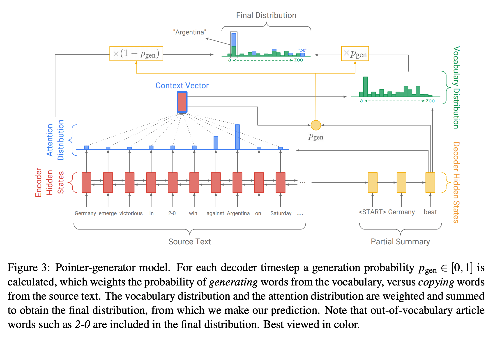

## Get To The Point: Summarization with Pointer-Generator Networks
### Abigail See, Peter J. Liu, Christopher D. Manning, 2017 
### 2017, [[arXiv](https://arxiv.org/pdf/1704.04368.pdf)] 

**Whats Unique**
This paper presents the technique for copy mechanism via pointing based on attention distribution, and avoid repetations by maintaining coverage state which penalise repeated higher attentions for the words.

**Major Contribution**
* Explicit probability to generate vs copy
* Copy mechanism by pointing.
* Coverage by avoiding repeated attention, and accomodating that in loss function.

**How It Works**

**Baseline Model (Seq2Seq with Attention)**
* Attention over hidden states in encoder, 
    * h_i is hidden state of word_i in encoder. 
    * s_t is decoder state at time t

        

*   Using context vector and decoder hidden state, the probability of vocabolary can be estiamted.

    

* **Loss function** can be designed as follow:

    

**Pointer Network**
* Probability of generating new word can be estimated using context vector, hidden state, and input word

    

**Coverage Mechanism**
* Coverage score is the sum of attentions till time step t
* Deriving new attention distribution, give access to coverage information as well
* Coverage loss will penalise the attention to give repeated higher value.

 

**Architecture Diagram**

<em>Source: Author</em>

