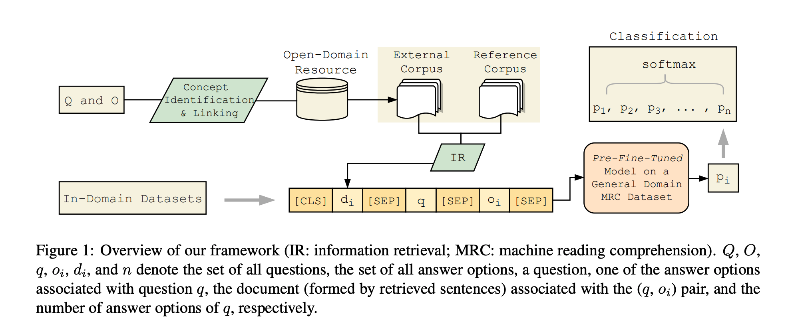

## Improving Question Answering with External Knowledge
### Xiaoman Pan, Kai Sun, Dian Yu, Jianshu Chen, Heng Ji, Claire Cardie, Dong Yu
### MRQA 2019

**Whats New** 
This paper presents how pre-fine-tuning and external open-domain and in-domain data can help better performance for solving QA problem.

**How It Works**
* BERT etc models are first trained on RACE dataset (Which is a larger dataset and does help in better pre-fine-tuning)
* It used wikipedia as the open-domain reference data, where some top sentences were extracted for mentions found in question. 
* Sapcy used to extract nouns, and then wikipedia page was disambuigated for such mentions. 
* Sentences are ranked, and top N sentences are extracted.
* Model was applied to ARC-Easy, ARC-Challange, and OpenBookQA. In-domain data levarages data from other datasets.
* Following figure illustrate the approach.

    
    <em>Source: Author</em>
    

** Results **
* For ARC-Easy, ARC-Challange, and OpenBookQA, absolute gains of around 8.1%, 13.0%, and 12.8%, respectively was achieved. 