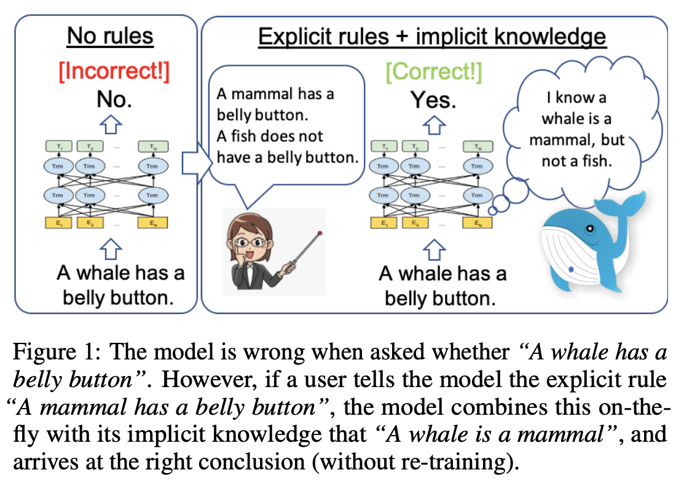
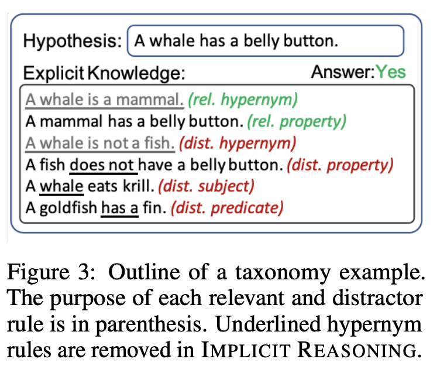
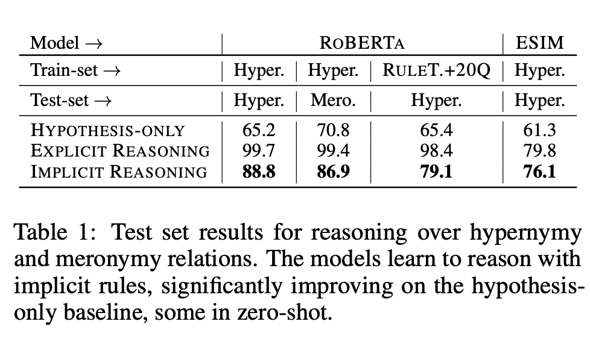
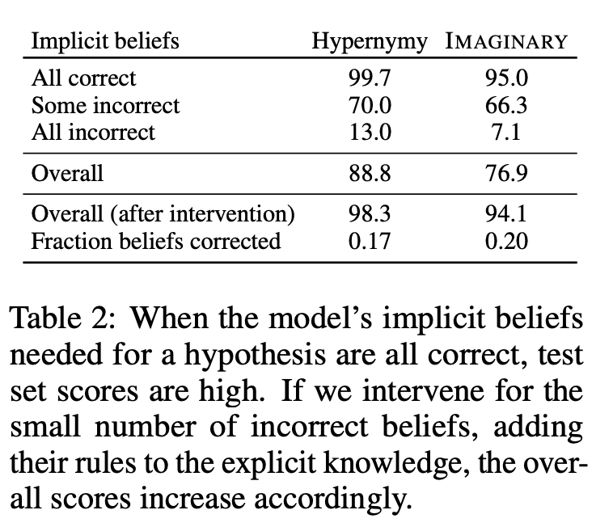

## Teaching Pre-Trained Models to Systematically Reason Over Implicit Knowledge
### Alon Talmor, Peter Clark et al
### NIPS 2020 [[arXiv](https://arxiv.org/pdf/2006.06609.pdf)]

**Whats Unique**
This work demonstrate that LMs can be trained to reliably perform systematic reasoning combining both implicit, pre-trained knowledge and explicit natural language statements. And, it also establishes that it is possible to teach the model ability to reason. It experiments on hypernym, and counting relations. 

**Experiment Design**

    
    <em>Source: Author</em>
    

* Above figure illustrate the motivation. 
* Following figure shows how data are prepared for the experiemnts of explicity and implicit knowledge.

    
    <em>Source: Author</em>
    

    
* Above example shows three possible experiments:
    * Just Hypothesis
    * Hypothesis + Implicit Knowledge (i.e. without hypernym explicit knowledge statements)
    * Hypothesis + Explicit Kbowledge

* Results are as shown below 

    
    <em>Source: Author</em>
    

* Probing Beliefs and Intervention by correcting Beliefs
    * Beliefs of models were probed by testing Explict and Implicit knowledge as hypotheis.
    * Accuracy of the model was much higher when all the knowledge statements were also the belief of the model.
    * When all the beliefs were wrong, if they were supplied, then accuracy goes much higher.
    

    
    <em>Source: Author</em>
    

* Similarily, experiement setup was designed for the counting relation.

