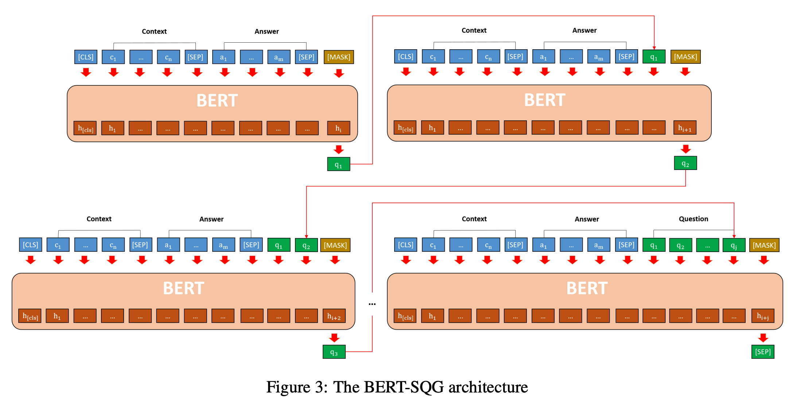
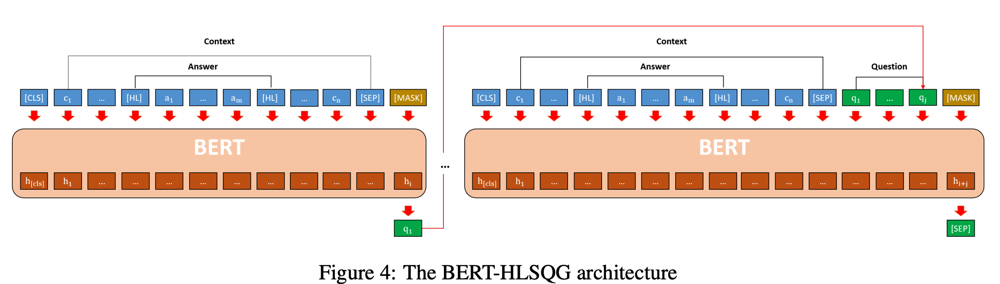

## A Recurrent BERT-based Model for Question Generation
### Ying-Hong Chan, Yao-Chung Fan. ACL 2019 workshop on Question Answering
### [[arXiv](https://www.aclweb.org/anthology/D19-5821.pdf)]

**Whats Unique**
This paper leverages BERT to generate questions, with couple of main changes, 1. HL token to surround answer, 2. Recurrent structure to generate each word.

**How It Works**
It compares three possible approches
1. The BERT-QG architecture (Baseline approach)
2. BERT-SQG (Sequential Quesetion Generation approach)
3. BERT-HL-SQG (Sequential question generation with HL token)

Following figures are self explanatory.

    
    <em>Source: Author</em>
    

    
    <em>Source: Author</em>
    

    
    <em>Source: Author</em>
    

* Results: It took the BLEU 4 score from around 16 (SOTA) to 21+.

