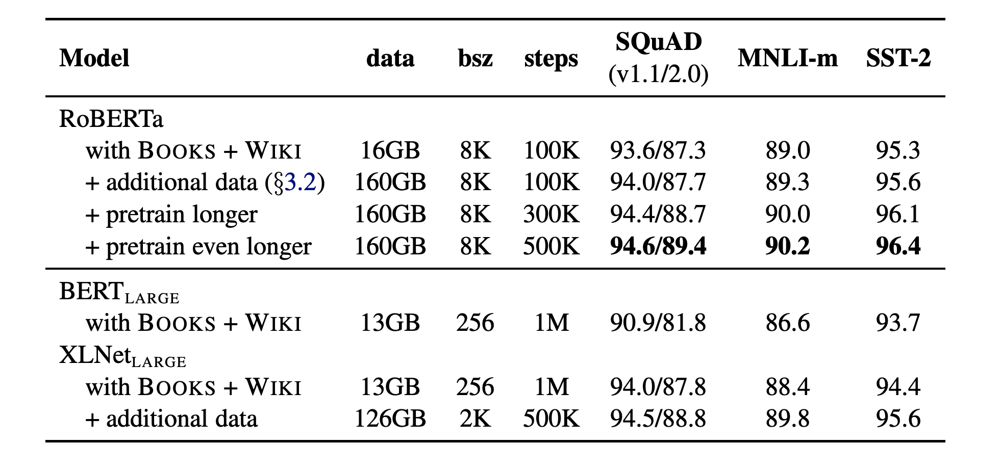

## RoBERTa: A Robustly Optimized BERT Pretraining Approach
### Liu et al, 2019, Facebook AI

* Paper finds that BERT was significantly undertrained and best model achieves SOTA results on GLUE, RACE, SQuAD.
* This paper gives better design choices and optimal parameter settings.
* Major contribution
    * Train model longer, with bigger batches over more data
    * Removing next sentence prediction objective
    * Train on longer question sequences
    * Dynamically changing the masking pattern
* BERT Overview
    * Input: [CLS], x1, x2, .. xN, [SEP] y1, y2, .. yN [EOS]; M + N <= T, i.e. maximum sequence length
    * MLM:
        * 15% input tokens are selected, of which 80% are replaced with MASK, 10% kept unchanged, and remaining 10% replaced with random noise.
        * Objective is to predict masked token using softmax
    * NSP:
        * To predict if first sentence is followed by next sentence using CLS token
    * Hyperparams
        * Adam: beta_1:0.9, beta_2: 0.999, e = 1e-6. 
        * L2 weight decay: 0.01
        * One cycle learning: LR increase till first 10000 steps, peak value 1e-4, linearly decayed afterwards
        * Dropout 0.1 on all layers
        * GELU activation
        * Pretraining
            * Steps: 1000000
            * B: 256 sequences
            * T: 512 tokens
        * Data (16 GB):
            * Book Corpus
            * English Wikipedia
* Design & Hyperparameter Choices
    * Adam beta_2 = 0.98 for improved stability
    * Input sequence of 512 tokens
    * Input DATA of 160GB from 
        * BookCorpus + English Wiki (16 GB)
        * CC-NEWS (76 GB)
        * OpenWebTex (38 GB)
        * Stories (31 GB)
    * Evaluation is done on GLUE / SQUAD and RACE
* Training Procedue Analysis
    * Static Mask has limitiation of same mask in each epoch, which is compared with dynamic masking (comparable or slightly better results)
    * Full-sentences sequence without NSP loss gave better results, and Doc-sentence (i.e. input sequence does not overlap two documents) gives best results among three.
    * Large batch size, 2K batchsize has given better PPL.
    * Byte level BPE (~50K vocab) compared with Character level BPE implemented with heuristics (~30K vocab), there is not much difference in the performance, so it is left to future work.
* RoBERTa: Robustly Optimized BERT Approach
    1. Dynamic Masking
    2. Full Sentences NSP
    3. Large Mini Batch
    4. Larger Byte-Level BPE
    5. Additional Input Data
    6. Train Longer
     

    
    <em>Source: Author</em>
    

    * GLUE: single task fine tuning vs multi task finetuning, and some task specific modification.
    * Roberta achieves state of the art in majority of GLUE tasks, Squad, and RACE.

