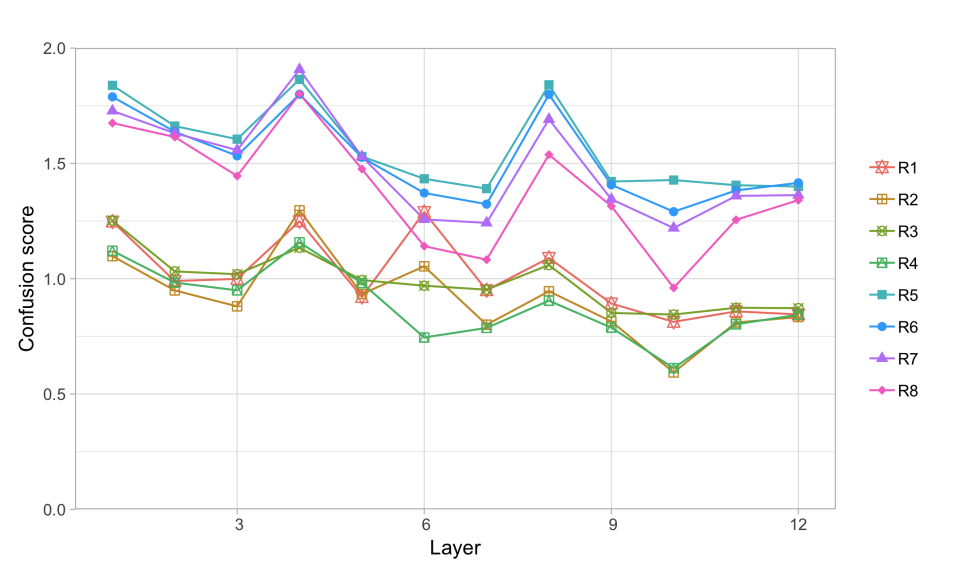

## Open Sesame: Getting Inside BERT’s Linguistic Knowledge
### Yongjie Lin, Yi Chern Tana, and Robert Frank
### 2019, ACL Workshop BlackboxNLP

**Whats new**
This paper tries to analyse BERT's representation and attentions, and establish that poistional information in representation vanish in higher layer, and its representations are able to capture syntactic hierarchical information. Its attention mechanism does show sensitivity if distractors are inserted to test linguistic dependency relations.

**How it is done** This paper has two different analysis

* Analysing Representation for three tasks
    * main auxiliary
    * subject noun
    * n-th token
* For each of these tasks, dianostic classifiers were trained, cross entropy was minimized in training. Evalution phase computes classification accuracy, 
    * Main Auxiliary: Sharply increase in initial layers, reaches peak at layer 5, and tapers off afterwards
    * Subject Noun: Improves initially, peak at layer 5 and then gradually dropa
    * Nth token: Falls sharply on layer on layer, with max value at initial layer. Almost give away positional info after 4th layer or so.

* Diagnostic Attention: Intrusion effect on attention: 
    * Datasets were augmented using CFG to inroduce distractor nouns etc. It inserts relative clause for subject, and additional nouns with match and mismatch genders.
    * Compute attention as some over all heads in layer l from X to Y. Where, x_i \in X are lignuistic units of interest (potential trigger) and Y is dependecy target. It computes attentions for each pair (x_i, Y)
    * Confusion score is negative log of expected attention (i.e. attn(x_1, Y)) over attention over all x_i.
    * Two tasks were analysed. 
        * Subject verb aggrement and 
        * Reflexive anaphora 
    * Analysis shows that confusion score is similar to random baseline (so, attention do not directly maximi) but it is sensitive towards distractors. i.e. in following figure confusion score gets lower as layers increases. And, each line are for different kinds of distractors with varying complexity. 

    

        
        <em>Source: Author</em>
        
