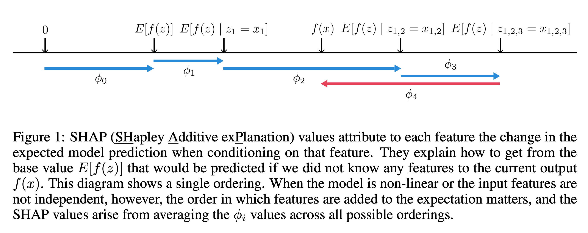

## A Unified Approach to Interpreting Model Predictions

### Scott M. Lundberg, Su-In Lee
### University of Washington

### NIPS 2017

**Whats new** This paper provides framework and theory for additive attributions based on shapely values, and desired properties, and approximate it with linear local estimations by LIME etc.

**How it works**
* Can any complex function f(x) be estimated by another function g(z'), where z' is simplified inputs, and g(z')=f(h(z'))? And, function g(z') is defined as follow:

    

    * Where, z' \in {0,1}^M, denotes if a particular feature is present or not. M is number of simplified input features. 

* LIME method tries to estimate that local function g for a given function f:

    

    * It is an estimation over set of samples using loss function L, which are weighted by local kernel Pi_x'.

* Classic shapely regression value estimation

    

    * Where, weight component represents numbers of possible permutations prior and post to input feature i, which is |S|! and (|F| - |S| - 1)! respectively.

* Now, to use this classic shapeluy equation in context, g(z') = f(h(z')), where z' is simplified input, denoting if a particular feature is present or not. Now, g(z') can be derived by estimating weights fi_i, where

    

    * These weights are esimated using local function, f_x, which is linear estimation in the local space based on if feature is present or not.

* Such function, g(z) can directly be esimated by minimizing loss in 2nd equation, which LIME does by sampling inputs near given input, and giving them weights based on kernel similarity.

* It shows, how feature importance are attributed for a particular prediction

    

        
        <em>Source: Author</em>
        

