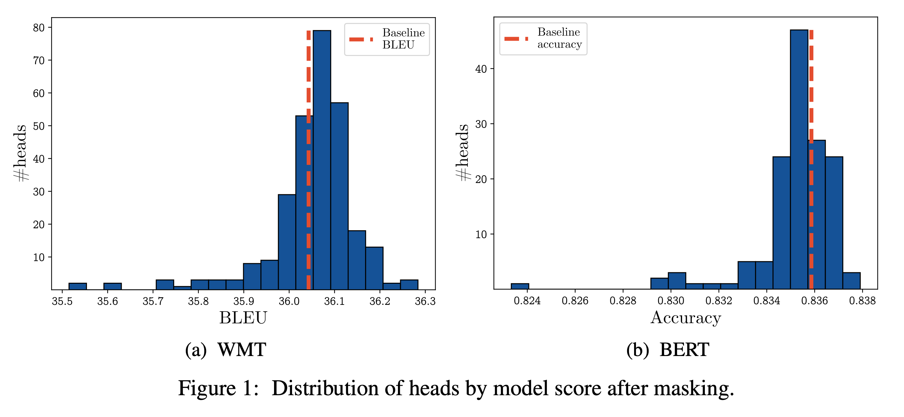
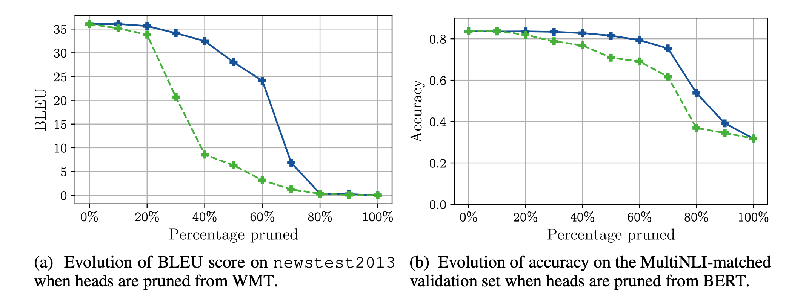

## Are Sixteen Heads Really Better than One?
### Paul Michel, Omer Levy, Graham Neubig
### NIPS, 2019

* Two major observations:
    * Large percentage of attention heads can be removed without impacting performance
    * Some layers can be even reduced to a single head.

* Approach note
    * One-head-masking: Individual each head was masked and its impact on accuacy was monitored. As in the figure below, majority of the heads can be removed individually without impacting performance.

    

    
    <em>Source: Author</em>
    

    * Ablating all heads but one: Experiment was done for each layer, where only one best head was kept. And, most of the layers can be reduced to single layer without impacting the performance much. Note each experiment was limited to one layer at a time.

    * Scatter plot shows that when individual heads are removed, its performance impact on one dataset has a high positive correlation with other dataset.

    * Iterative pruning of attention heads
        * Importance of each head was derived by taking derivative of loss over weighing parameter sai for that head.
        
        

        

        

        * Based on importance, iterative pruning of each head was done, and its impact can be seen as below:

        

        
        <em>Source: Author</em>
        

        * As shown above, around 20-30% heads can be pruned. 

        * Also, it not only reduces numbers of paramters but also inference speed.

    * Effect of pruning head during training time was also measured, and it was inferred heads can be pruned early in training (not in very begining though) without impacting performance much.
