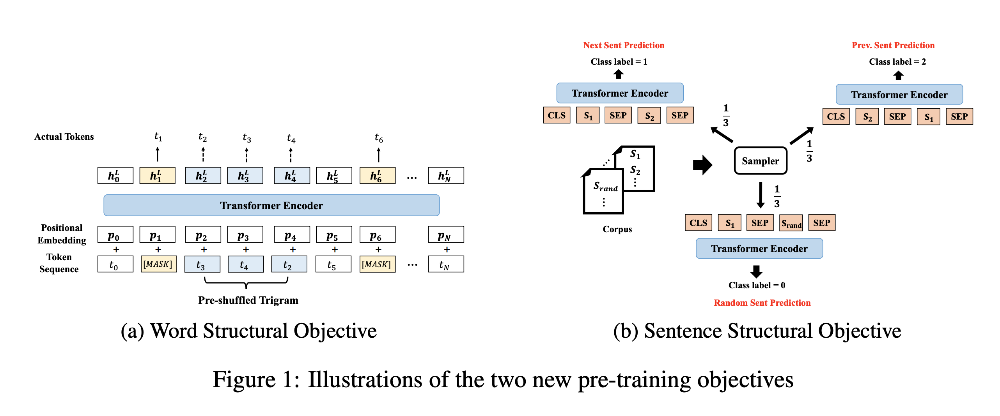
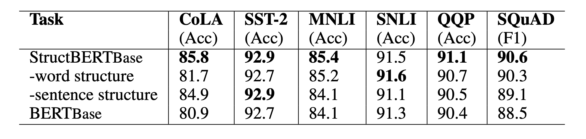

## STRUCTBERT: INCORPORATING LANGUAGE STRUCTURES INTO PRETRAINING FOR DEEP LANGUAGE UNDERSTANDING
### Wang et al, Alibaba Group
### ICLR 2020

**Whats New** This paper proposes two new pre training objectives, word ordering, and sentence order detection. And, ablation study suggest that major improvement for single sentence tasks come from word ordering objective, and for multi sentence tasks comes from sentence order detection.

**How It Works?**
* Following figure illutrate both these objectives.
    

        
        <em>Source: Author</em>
        

* As shown in the figure above, 
    * Around 5% of time, it shuffles 3 tokens, and objective is to detect the right ordering.
    * Around 33% of time, either it is next sentence, or previous, or a random.

* Ablation study results are as follow
    

        
        <em>Source: Author</em>
        

* Overall, it has outperformed most to the bert variants on GLUE, SQUAD etc. And, StructBert on Robberta setup has given even better results.

