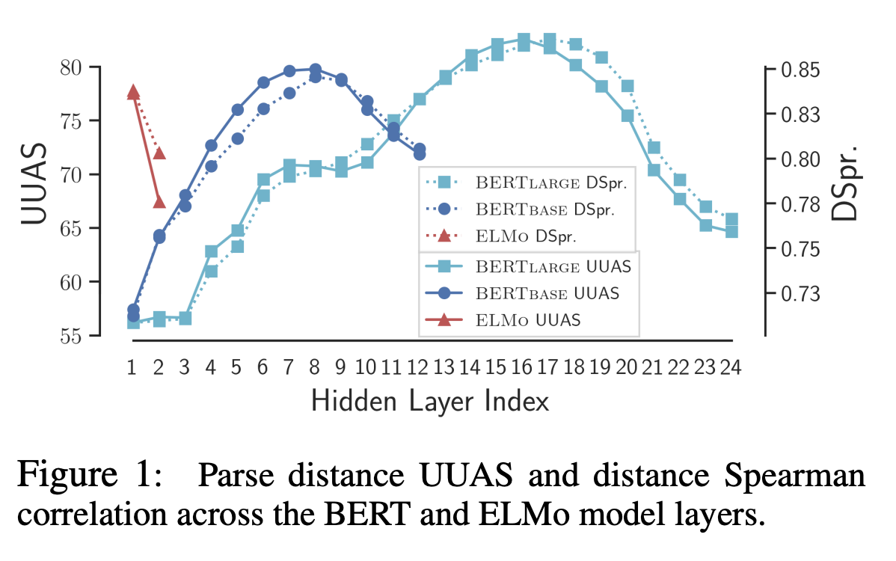
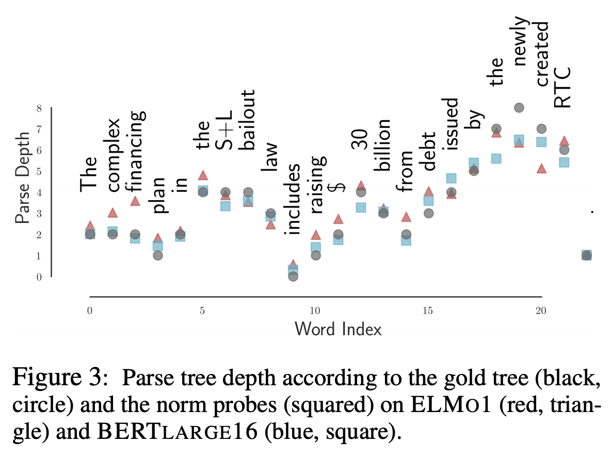
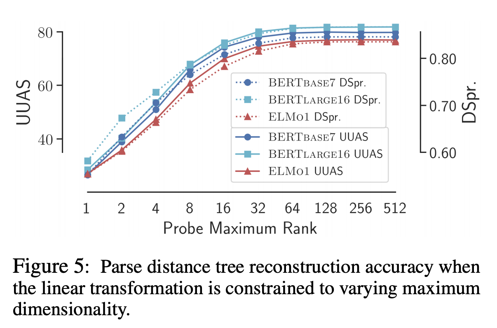

## A Structural Probe for Finding Syntax in Word Representations
### John Hewitt, Christopher D. Manning
### 2019, NAACL 2019, Standford

**Whats new** This paper proves that linear transformartion of vector space of BERT and ELMO embeddings does embed liguistic structure, i.e. dependency tree.

**How is it done**
* Linear transformation is learnt which would capture the linguist structure

* Model 1: distance between words in dependency trees is  as distance between two vector representation which are linear transformation of embeddings

    * 
    * 

* Model 2: level of depth in dependence tree is learnt as squared norm of linear transformation of embeddings
    * 

**What are major insights**
    * Following figure illustarte that UAAS score of aroun d 80 is observed and it is observed at hidden layer index of about 8 in 12 layer BERT, and aroubt 18 in 24 layer BERT.
      

        
        <em>Source: Author</em>
        

    * As shown below, dependency tree depth is highly correlated highly with gold labels. 
    

        
        <em>Source: Author</em>
        

    * It can be seen that linear transformation would project BERT and ELMo vectors in to space of lignuist strcture, how dimensions of these projections impact performance... beyond 64 dimensions, it does not help much to increase dimensionality.
     

        
        <em>Source: Author</em>
        
