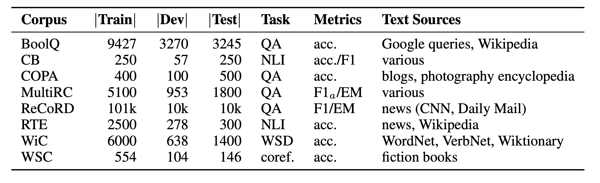
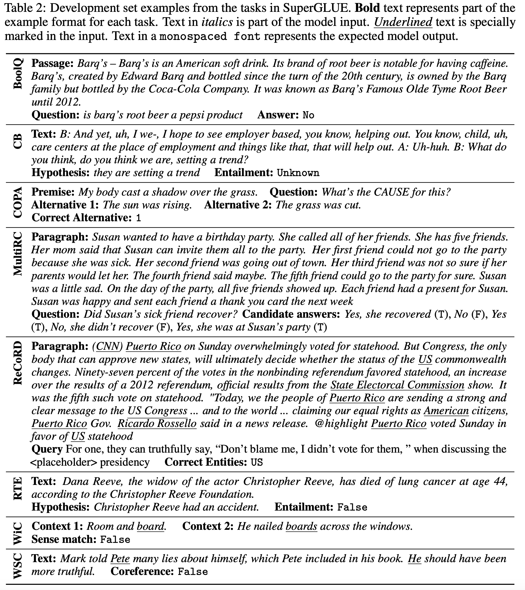

## SuperGLUE: A Stickier Benchmark for General-Purpose Language Understanding Systems
### Wang et al
### NYU, Facebook AI Research, Deep Mind, 

**Whats New** It is stricter benchmark for general purpose language understanding, and more challanging then GLUE, with challanging tasks, diverse tasks, human baselines, code support, and usage rules.

**Tasks in SuperGLUE**
* It has majorly four types of tasks - question answering, natural language inferce, word sense disambiguation, and coreference resolution.

* Figure below gives overview on task name, type, number of samples etc

<em>Source: Author</em>

<em>Source: Author</em>

**BERT Baseline Approach**
* Bert-large-cased was used.
* Fine tune pretrained model for each task seperately
* Adam with initial learning rate of 10^-5, and max epochs were 10
* Binary Classification tasks:
    * BoolQ, CB, RTE, WiC
    * Logistic regression classifier on CLS token, for WiC marked word representation is concatenated to CLS token.
* COPA, MultiRC, and ReCoRD
    * Concat answer choice with context, and feed to BERT
    * COPA: select context-answer representation with highest associated scalar
    * MultiRC: Binary classifier on context-answer repr
    * ReCoRD: probability of each candidate, and select most likely.
* Span representation was computed based on self attention span pooling operator.

**BERT++ Baseline Approach**
* Additional training on related datasets, following two-stage style of transfer learning
* MultiNLI for CB, RTE, and BoolQ
* SWAG for COPA

**Baseline Results**
* Most Frequent class gives 47.1%, while CBOW using GLOVE gives only 44.3%. CBOW fails in superGLUE tasks miserably.
* BERT brings 25% abosulte improvement. (69%)
* BERT++ after leveraging other training data, etc has given further 2.5% improvement. (71.5%)

