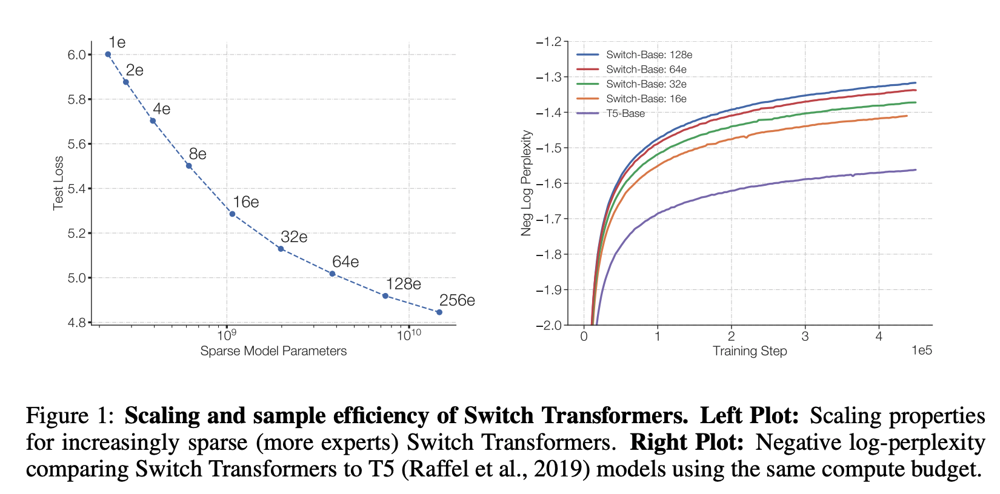

## Switch Transformers: Scaling to Trillion Parameter Models with Simple and Efficient Sparsity.
### Fedus, William, Barret Zoph, and Noam Shazeer.
### arXiv preprint arXiv:2101.03961 (2021) [[arXiv](https://arxiv.org/pdf/2101.03961.pdf)].

**Whats Unique**
In Deep Leanring, models typically reuse the same parameters for all inputs. The Mixture of Experts (MoE) models defy this and instead select different parameters for each incoming example, which results in sparsely-activared model. It has outrageous numbers of parameters but a constant computational cost. 

It suffers from complexity, communication costs and training instability. Switch Transformers address these challanges and obtain upto 7x increases in pre-training speed.

**Architecture**
* The Fully Connected Dense Feed Forward Network layer is replaced by sparse Switch FFN layer. Where, router independently route the input sample.
* Following figure demonstrate the same.

    
    <em>Source: Author</em>
    

* More the numbers of experts, more would be sparse model parameters, but it scales well interms of model performance, i.e. perplexity. Which can be seen in the figure below.

    
    <em>Source: Author</em>
    

**Sparse Routing**
* Mixture of Expert Routing (Shazeer et al. 2017)

    

* Switch Routing: Author uses K=1 in Mixture of Expert Routing setup. It has following benefits
    * Router computation is reduced, as now input token is routed to only single expert.
    * The batch size of each expert would be small, as it only needs to consider the tokens being routed to a single expert.
    * Each expert has the fixed batch size, i.e. (total_tokens / num_experts ) * capacity_factor. If an expert recieve extra tokens, these tokens would be forwarded as they are. Capacity factor would enable more expert capacity, but it would add extra blank tokens to other experts.
    * Differentiable Loss:
        
    * Note, f_i is not differentiable, but P_i is differentiable. 

**Key Decisions**
* Selective Precision: floating16 precision can exacerbate the instability. So, only in the local part of the model floating32 precision was used, and rest were reduced to fp16.
* Smaller parameters initialisation further improves the stability. Where, paraters to initialise models are scaled by 0.1. This improves the std dev of quality.
* A smaller dataset, with large parameter sized model would cause the problem of over-fitting. Expert dropout is increased to handle this, upto 40%.

