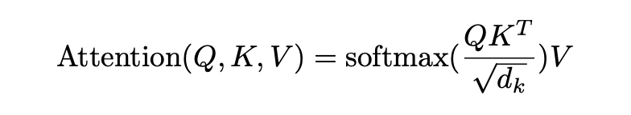
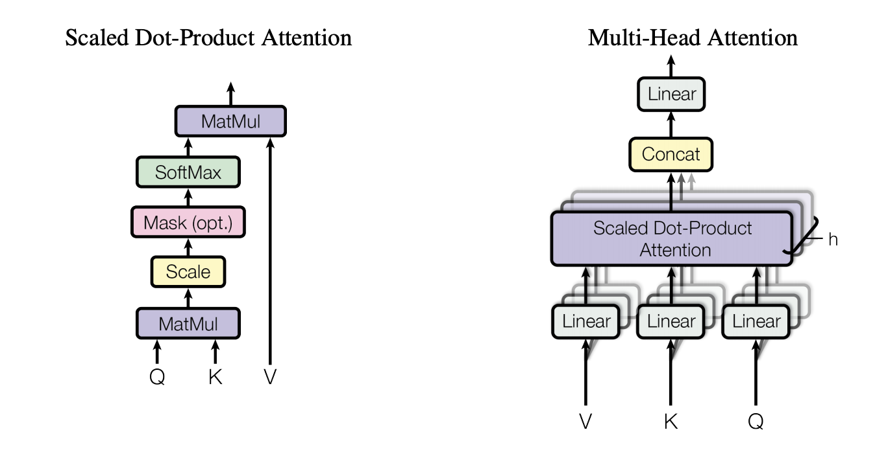
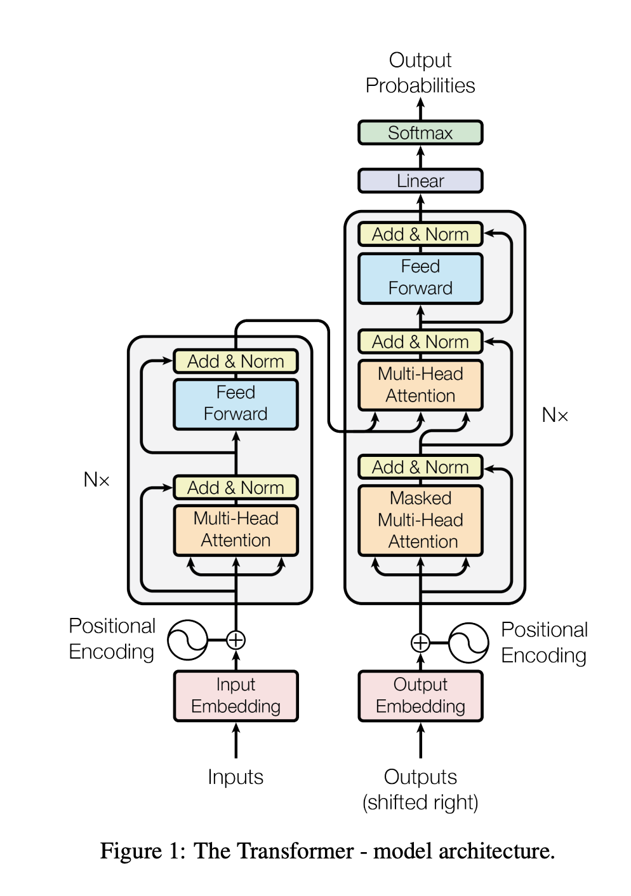

## Attention Is All You Need
### Vaswani et al, 2017, Google Research

This has proven to be a path breaking moment for NLP in recent times. 

Major contributions:
* Transformers architecture solely depends on attention mechanisms, dispensing with recurrence and convolutions entirely. 
* It is parallelizable and requires significantly lesser time to get trained.

* It establishes new SOTA architecture compared to currently established RNNs, LSTMs and GRUs for sequence modeling and transduction tasks.
    * RNNs suffers from its sequential nature, as it precludes parallelism with in training examples, which become critical at longer sequence lenths.
    * Convolutions also are linear or logrithmic functions of distance between inputs to influence each others. Hence it is more difficult to learn dependencies between distant positions.
    * Transformers reduces ability to learn distant positions to a constant number of operations.
    * Limitation of reduced resolution as it averages across all input positions is counteract by multi head attention.

* **Attention**: Attention is mapping between query and key-value pairs, where output is computed based attention weighted average of values, where attention weights between query and key is derived based on some compatibility function.

* **Scaled Dot-Product attention**: Compute dot product of all keys with queries and then divide by sqrt(d_k) and apply softmax to get probabilities.
    

    
    <em>Source: Author</em>
    

* **Mutli-Head Attention**: Instead of performing single attention function with d_model dimensional keys, values and queries, they are independently projected with seperately learned linear projections of d_k dimensions using h attention heads, where h = d_model / d_k
    

    
    <em>Source: Author</em>
    

* **Architecture**
    * **Encoder**: 
        * Stack of N=6 layers. Each layer stack two sub-layers, multi-head self attention, and point wise, fully connected feedforward network.
        * Residual connections around each of these two layers followed by layer norm
        * To facilitate residual connections, dimensions of each layer, embeddings etc are kept constant.

    * **Decoder**:
        * Stack of N=6 layers. In addition to tow sub-layers, decoder inserts one more multi-head attention over output of encoder stack. Where K, V comes from encoders and Query comes from decoder.
    * Masking to make sure self-attention does not attent subsequent positions.

    

    
    <em>Source: Author</em>
    

    * Feedforward layer has one hidden layers of dimensions 2048, where as inputs and outputs are of same d_model dimensions

    * Since model does not leverage recurrence or convolutions, in order to make use of positions, positional encodings are added to inputs and outputs (shifted right) at the bottom of transformers. 

    * It has achieved SOTA BLUE score, and became unarguably the best architecture to set new SOTA on majority of NLP tasks.

