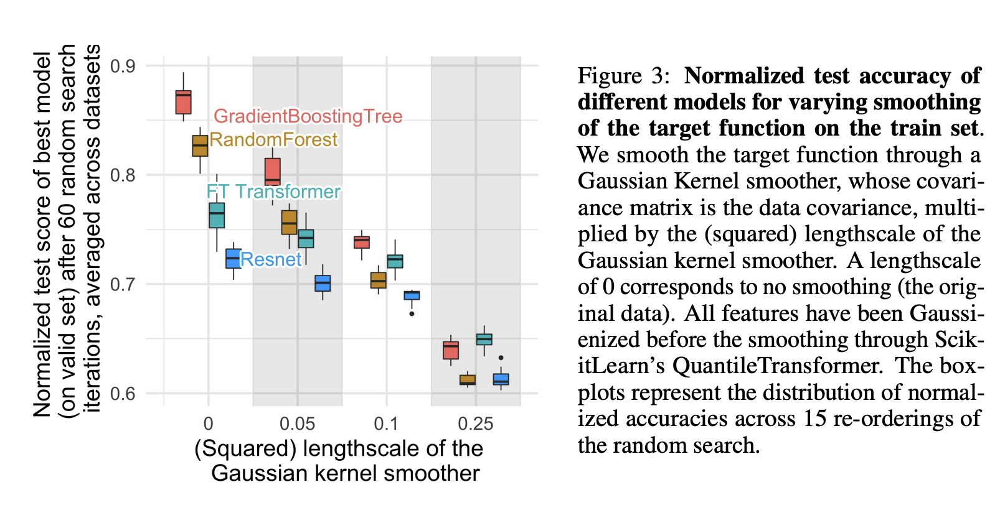
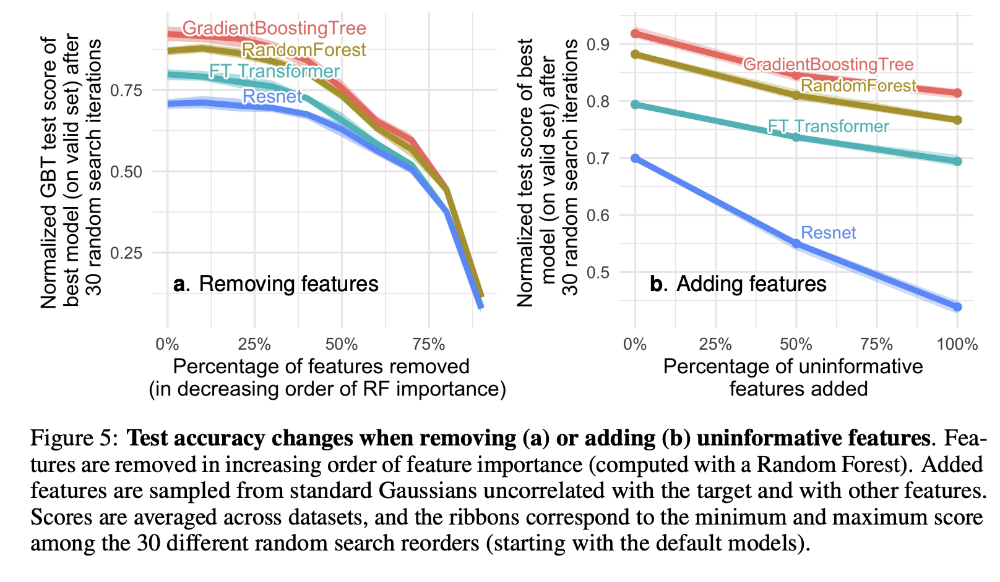
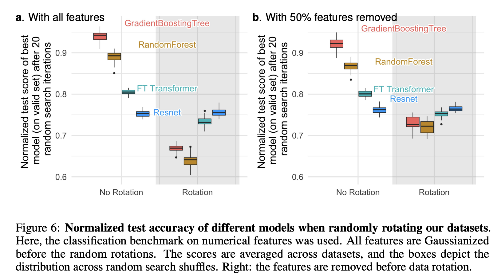

## Why do tree-based models still outperform deep learning on typical tabular data?
### Grinsztajn, L., Oyallon, E., & Varoquaux, G. (2022)
### Advances in neural information processing systems, 35, 507-520.

** Key Points **
* The major contribution from this paper is as follow
    * Prepare a tabular data for the benchmarking
    * Compare tree based and neural models, publish the raw results
    * Data transformations to discover the inductive bias in tree vs neural models

* Major findings regarding the inducative bias are

    * Neural Networks are biased towards smooth target functions. i.e. More smoothened targets helped NN in comparision to tree models. 

     

    
    <em>Source: Author</em>
    

    * Uninformative features affect NNs more than the tree based models. The study was done by understanding the performance gap when the uninfromative features were removed.
    
    

    
    <em>Source: Author</em>
    

    * NN models are invariant to rotational transformation of data
   

    
    <em>Source: Author</em>
    

    