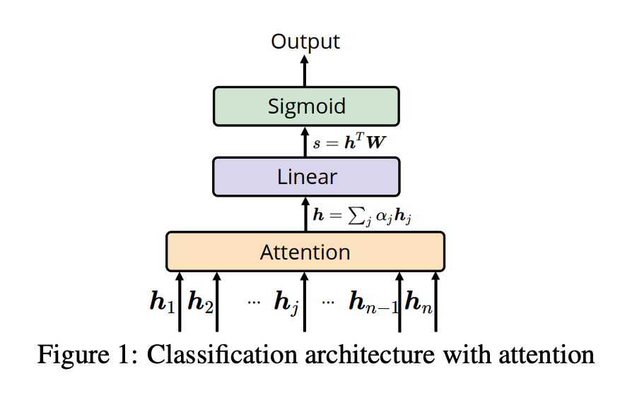
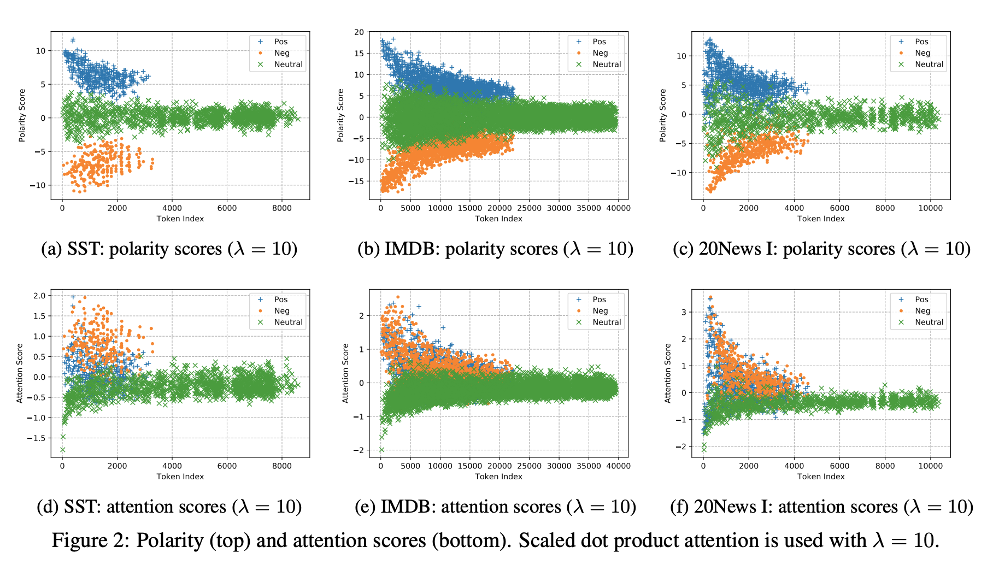

## Understanding Attention for Text Classification
### Xiaobing Sun and Wei Lu
### ACL 2020

**Whats New**
This paper present an analysis to understand attention mechanism, it splits attention mechanism into attention score, weights and polarity score, where attention score is absolute importance of word for a context, attention weight is relative one for the sequence, and polarity score for token's polarity towards a label. 

**Key Insights**
* Polarity would get aligned to label as part of training, so sooner positive tokens would have positive score and negative tokens would have negative score.
* Attention scores of positve tokens would be positive, and with hence higher attention weights, which will drive to positive polarity score, and label score, which would minimize loss.
* Higher lambda would bring down variance in attention scores and hence attention mechanism would reduce to pooling. 

**How it is done**
* A simplified architecture of attention mechanism is done, can be seen in the figure below.

    

    
    <em>Source: Author</em>
    

* For a context vector V, attention score is 

    

* Which is then converted to attention weights using softmax, 
    

* Note, let say for task of binar classification, context would be learnt as represenation of positive class, and any positive tokens similar to tokens would have positive attention score, and hence relative higher weight.

* Attention weights would mix input sequence based on its relative importance, 

    

* And, output of linear layer would be

    

* And, overall loss would be computed as follow:

    

    * where, if label is positive, expected polarity score woould be positive, and naturally, those positive contribution would come from positive tokens, which can be seen as below:

        

    * where, we can define token level polarity as 

        

**Experimental Insights**

    
    <em>Source: Author</em>
    

* We can see in the above figure how polarity score is differentiated between positive, negative and neutral tokens.
* We can also obsever, those positive and negative tokens gets higher attention score, hence they would also have higher attention weights, which would lead to correct label classification, and minimizing loss.

