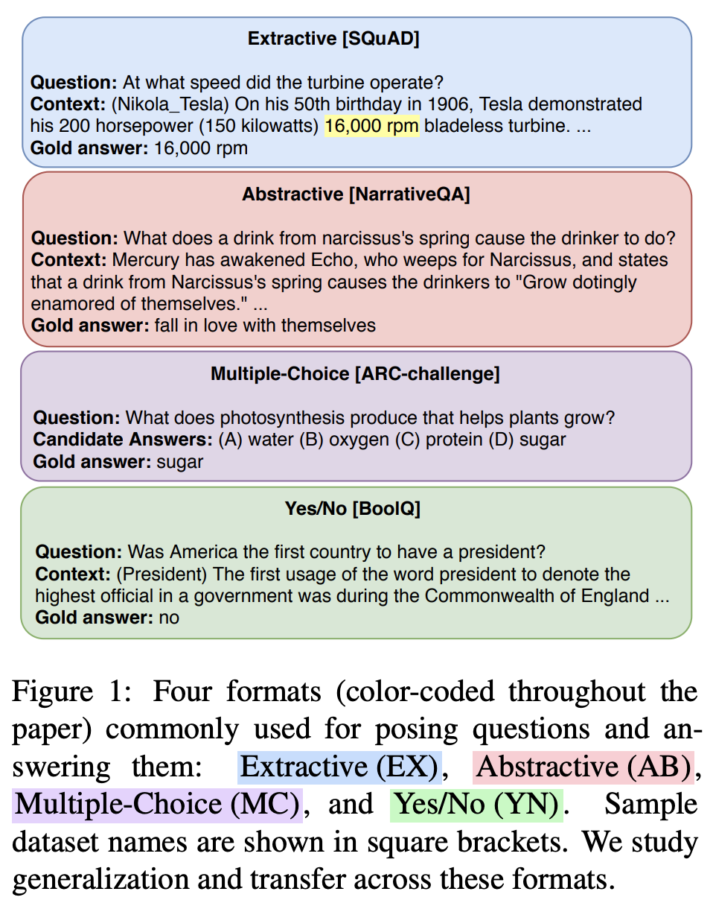
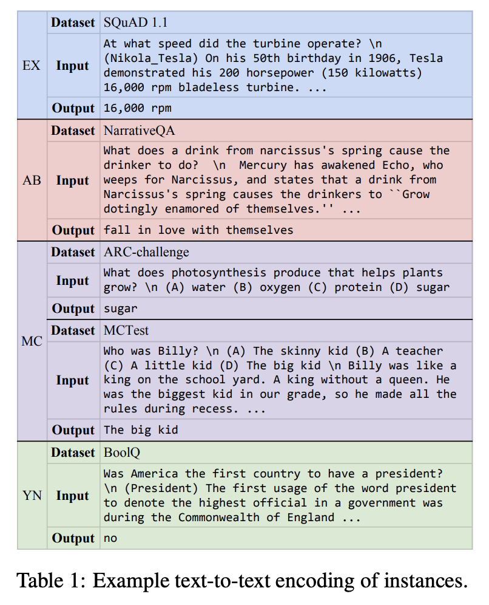
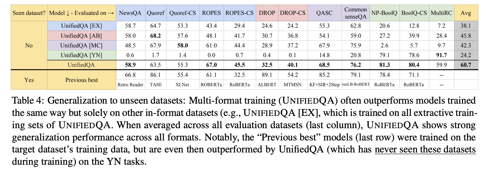
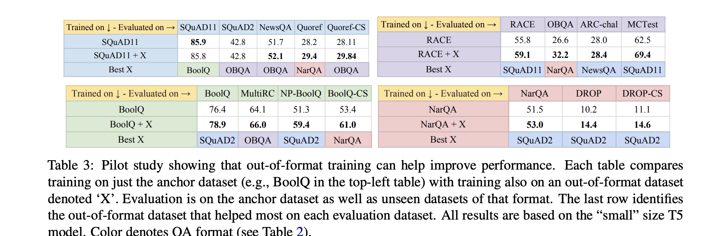

## Unifiedqa: Crossing format boundaries with a single qa system.
### Khashabi, Daniel, Tushar Khot, Ashish Sabharwal, Oyvind Tafjord, Peter Clark, and Hannaneh Hajishirzi.
### arXiv preprint [[arXiv:2005.00700](https://arxiv.org/pdf/2005.00700.pdf)] (2020).

**Whats Unique**
QA tasks have been posed with variety of formats, such as span extractive, multiple choice, boolean, abstractive. Author propose singular pre-trained QA model, UnifiedQA, that performs well on 20 QA datasets spanning 4 different formats, and when faced with 12 unseen datasets of observed format, it does surprisingly well. And, finetuning this on 10 factoid and commonsense dataset produces new SOTA performance.

**Four Diverse Format of Datasets**
Following figure presents four different dataset formats.

    
    <em>Source: Author</em>
    

Following figure shows the properties of various QA datasets. 

    
    <em>Source: Author</em>
    

All the datasets were reduced in the following format:
question \n [Answer Options] \n [Context]

Afterwhich, it is given as input to T5 model. We can see examples of such text-to-text encoding for different types of datasets as below. 

    
    <em>Source: Author</em>
    

**Results**
* It almost matches the performance of task specific fine tuned T5 model.

* It has much better generalisation ability on unseen datasets. It also outperforms SOTA models.

    
    <em>Source: Author</em>
    

* It also proves that pre-training on out-of-format dataset helps to improve performance on unseen dataset.

    
    <em>Source: Author</em>
    

* Fine-tuning UnifiedQA further on a particular dataset gives SOTA performance.

