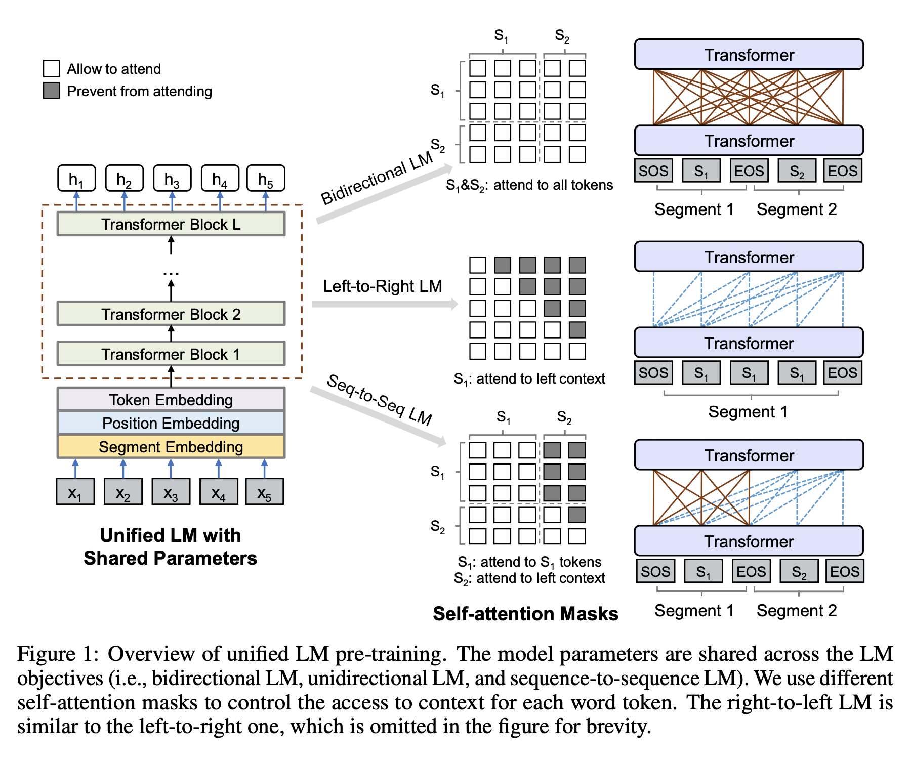

## Unified Language Model Pre-training for Natural Language Understanding and Generation
### Dong et al., Microsoft Research, 2019

* This paper present an approach for both NLU and NLG tasks
* It takes pre-trained BERT, and modify
    * Its mask mechanisms to support unidirectional, bidirectional, and seq-2-seq masking
    * It trains stacked transformer blocks on three different LM objectives
        * 1/3 time unidirectional, 1/6 for left-to-right, and 1/6 for right-to-left
        * 1/3 time bidirctional objective
        * 1/3 time seq-to-seq objective
* Following figure illustrates the architecture of UniLM
    

    
    <em>Source: Author</em>
    

* Input Representation and Masking
    * Bidirectional & Seq2Seq: 
        [SOS] x_1 x_2 .. x_n [EOS] t_1 t_2 .. t_m [EOS]
    * Unidirectiobal
        [SOS] x_1 x_2 .. x_n [EOS]
    * Input tokens are randomly masked, and based on LM objectives their representation is learned. 
* Experiment Setup
    * Initialized with BERT large
    * Vocab: 28996
    * Max Input Seq: 512
    * Masking pattern is like bert
    * Adam: beta_1 = 0.9 and beta_2 = 0.999
    * Learning rate: 3e-5 with linear warmup over 40K, and then linear decay
    * Dropout 0.1
    * Batchsize 330
    * Transformer layers: 24
    * Hidden Size: 1024, Attention heads: 16
    * Paramerters: 340M 
    * 8 Telsa V100 32GB: 7 Hours

* Finetuning:
    * NLU tasks with Bidirectional Objective
    * NLG with Seq2Seq with masking only on target sequence

* Abstractive summarization
    * Seq2Seq
    * Masking Prob in Target Sequence is 0.7
    * 30 Epoch
    * Beam Search of size 5
    * Gives SOTA for both CNN/DailyMail and Gigaword dataset

* Question Answering:
    * Extractive QA: 
        * NLU task, need to find start and end span
        * Bidirectional objective
    * Generative QA:
        * NLG Task
        * Seq2Seq: First Seq: Conversational History, Question, and Second sequence is answer.
        * Masking probability in answer is 0.5, and beam search of size 3
    * Answer aware question generation:
        * NLG, Seq2Seq
        * First segement: concat(input passage, answer), second segment: generated question
        * Masking probability 0.7
    * Imprpving QA with Generated Questions
        * 5 millions answerable questions were generated, and four millions unanswerable examples by modifying answerable ones.
        * It improves QA by 4 point increase in F1. Builds SOTA
    * It improves GLUE benchmark by 0.5 percent from BERT_large 

* Potential Opportunity
    * Seq2Seq models are best trained when there is relevant such data are available. This paper just take same 16 GB data of wikipedia and story, and force fit even seq-2-seq  objective on it, which may not be ideal. However at finetuning time, as model is getting trained with proper data, it is getting handled at some extent. Also, it is difficult to get seq 2 seq data in pre-training phrase. 
    