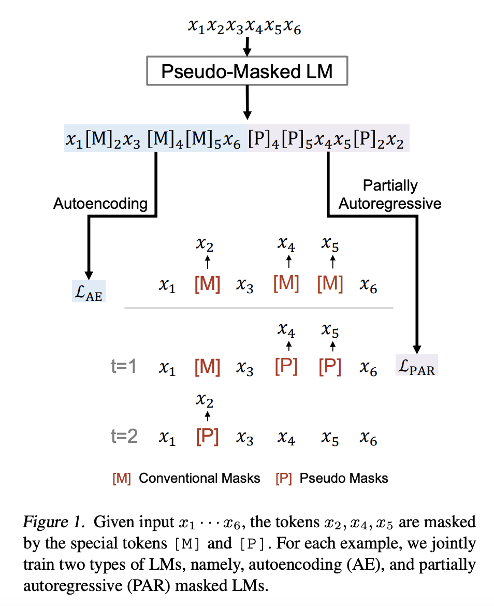
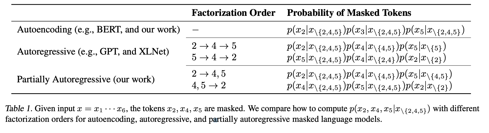
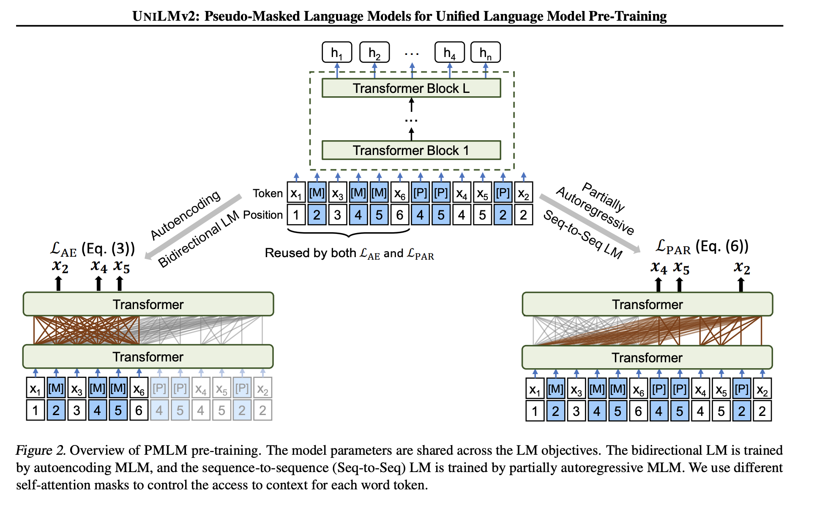
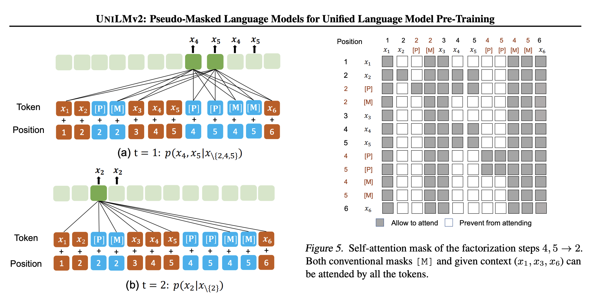

## UNILMv2: Pseudo-Masked Language Models for Unified Language Model Pre-Training
### Hangbo Bao et al. 
### 2020 [[arXiv](https://arxiv.org/pdf/2002.12804.pdf)]

**Whats Unique**
It invents an unified language model for both autoencoding (BERT like) and partially autoregressive language (XLNet for Span) modeling tasks using a novel training procedure referred to as a pseudo masked language modelling. 

**How It Works**
* Conventional masks to learn inter-relation between corrupted tokens and context via auto-encoding. 
* Pseudo masks learn intra-relations between masked spans via partially auto-regressive modeling.

    
    <em>Source: Author</em>
    

* Auto encoding objective remains conventional.
* Partially auto regressive objective lets psedo masked span attend to prior predicted tokens, and corresponding masked tokens. 

Following table gives an overview of how Auto Encoding, Auto Regressive objective, and Partially Auto Regressive objective. 

    
    <em>Source: Author</em>
    

Following figure shows pseudo masked language models for Unified model pre-training. It appends input sequence with pseudo masked tokens as well as original tokens for masked ones. And, with attention mechanism it trains model with dual objectives at the same time.

    
    <em>Source: Author</em>
    

**Model**

* Auto encoding loss

* Partially Auto-regressive Modelling
    * In each factorization step, a model can predict one or multiple tokens.
    * Let M = < M1, M2, .. M_|M|> is factorization order, where M_i = {m_1, .., m_i}, or set of token span to be masked in factorisation step i
    * 

    * 

* Following figure illustrate the implementation details at attention mask level.

    
    <em>Source: Author</em>
    

