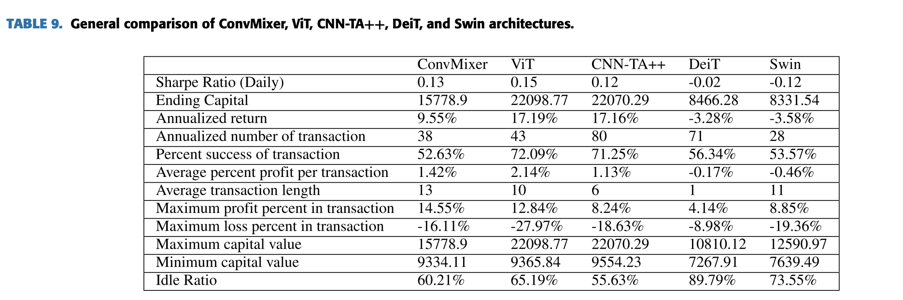

## Deep transformer-based asset price and direction prediction. 
### IEEE Access.
### Gezici, B., & Sefer, E. (2024). 

**Key Points**
- This paper apply advanced transformers based and patch based techniques on the decisions like buy, hold and sale labels.
- Transformer based techniques includes (i) Vision Transformer, (ii) Data Efficient Image Transformer, (iii) Swin. and, ConvMixer uses patch-embedding-based neural network. 
- Data Preperation (Image creation):
    - 9 ETFs are considered
    - 65 technical indicators on volatility, momentum, volume, overlap studies, price transformation, and statistics etc.
    - 65 days data is considered to create an image of pixels 65x65.
- Vison Transformer 
    - Pure transformer for image like data.. 
    - ViT applies self-attention directly to sequenced image patches.
    - Given image of W x H, and a patch size B, ViT transfoms image into W/B x H/B size components. 
    - Multi-layer encoder is applied on these flattened image. 
- Conv Mixer
    - It preserves locality using tensor patch embeddings
    - it transform an image of c x n x n to h x n/p x n/p where p is patch size and h is embedding dimensions.
- Data Efficient Image Transformers (DEIT)
    - Vision transformer based on the knowledge distillation
    - It minimize the loss with KL divergence and Cross entropy.
    - Strong teacher model, which makes a transformer model learn soft label with distillation loss.
- Swin Transformer
    - Intuition: the pixels in images are much higher than the word in a text document.
    - Swin transformer applies hierarchical transformer to deal this challange.
    - Image-like input is split into non-intersecting patches similar ViT. Each patch is considered as token. 
    - Hierarchical structure reduces the resolutions of image in each layer.
    - It uses shifted window attention for compute efficiency.
- The comparison of financial metrics by these models are as below:

    
    <em>Source: Author</em>
    

