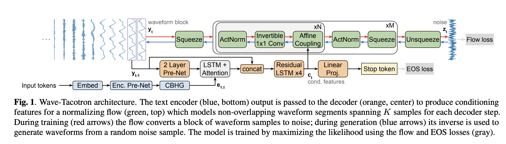

## Wave-Tacotron: Spectrogram-free end-to-end text-to-speech synthesis.
### Weiss, Ron J., R. J. Skerry-Ryan, Eric Battenberg, Soroosh Mariooryad, and Diederik P. Kingma. 
### In ICASSP 2021-2021 IEEE International Conference on Acoustics, Speech and Signal Processing (ICASSP), pp. 5679-5683. [[IEEE, 2021](https://arxiv.org/pdf/2011.03568.pdf)].

**Whats Unique**
* It proposes a sequence-to-sequence neural architectre which directly generates speech waveforms from text inputs. Output waveforms are modelled as a sequence of non-overlapping fixed length blocks, each containing hundreds of samples. Such output blocks are generated auto-regressively, and each block can benefit because of parallel training and synthesis.

* Backgound:
    * Recent TTS system mainly divide task into two parts: 
        * A synthesis model: predict intermediate features (like spectogram) from text
        * A neural vocoder: it generates spectogram
    * Both these models are trained seperately or can be fine-tuned jointly.
    * Vocoder models are typically auto-regressive models such as WaveNet or WaveRNN. Or Flow based models, or GANs models.

* How Does It Work?
    * It extends the Tacotron attention-based sequence to sequence model, generating blocks of non-overlapping waveforms samples instead of spectograms.
    * The CBHG encoder encodes a sequence of I tokens embeddings X 1:I.
    * The text encoding is passed to a block-autoregressive decoder using attention, producing c_t for each output step t.
    * A normalizing flow uses these features to sample an output waveform at each step. g(z_t, c_t).
    * The normalizing flow is a composition of INVERTIBLE transformations that maps a noise sample drawn from a sperical guassian density to a waveform segment.
    * While training, the inverse g^-1 maps the target waveform to a point under the sperical guassian whose densitity is easy to compute.

    * Following figure illustrates the architecture of UniLM
    

    
    <em>Source: Author</em>
    

    * It is much faster than Tacotron + WaveNet and it is comparable (slightly lesser) in accuracy. 

