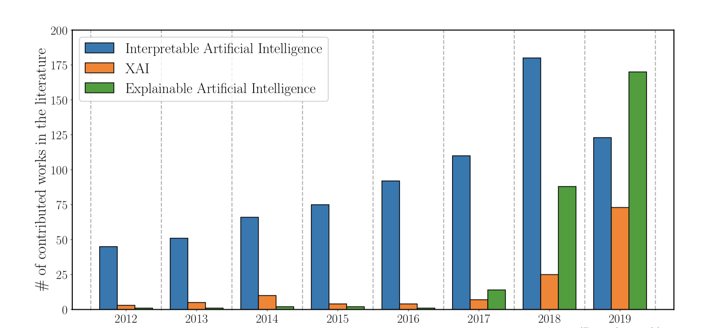
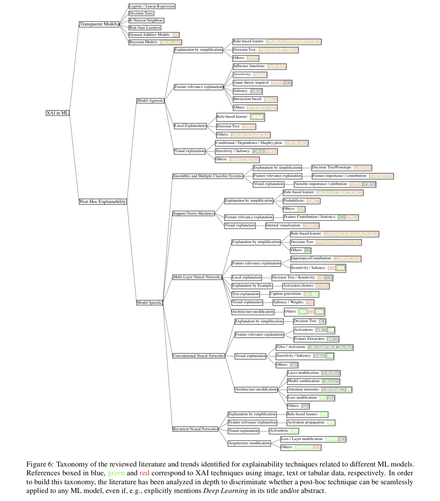
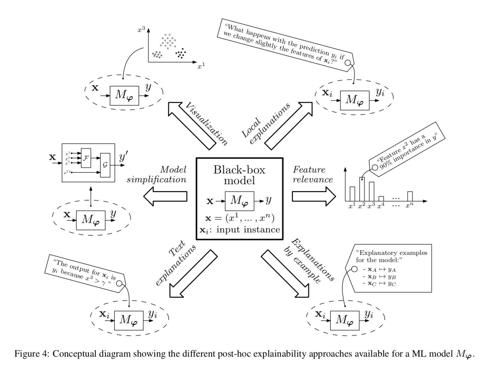
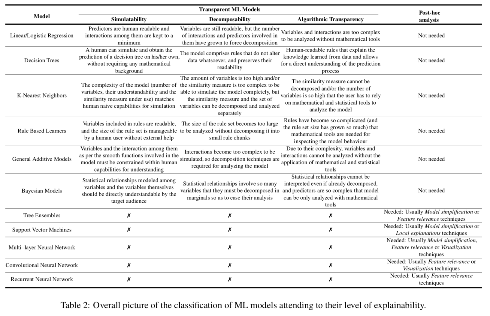
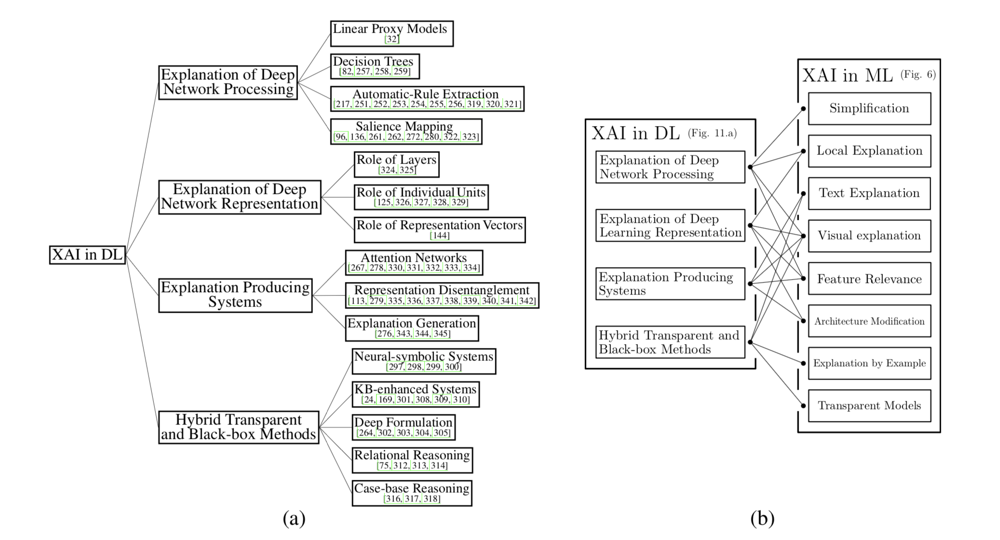
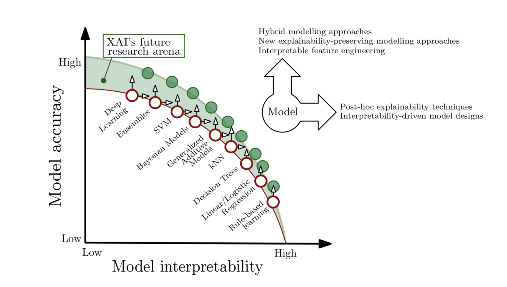
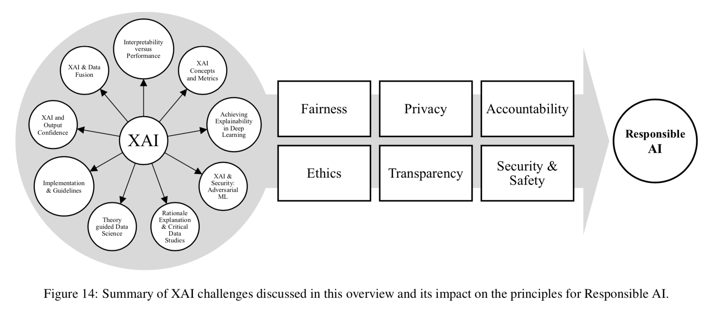

## Explainable Artificial Intelligence (XAI): Concepts, Taxonomies, Opportunities and Challenges toward Responsible AI
### Arrieta et al., 2019 
### [[arXiv](https://arxiv.org/abs/1910.10045)]

**Whats Unique**
This is a survey and review paper on explainable AI. Which focuses on the need of explainability, and how interpretability enables it. It categories classic machine learning techniques and latest deep learning approaches with XAI taxonomies. It also gives alternate XAI taxonomy for deep learning techniques. 

**Key Highlights**
* Interpretability helps ensure 
    * the impartiality in decision-making.
    * robustness by highlighting potential adversarial perturbations
    * only meaningful variables infer the output.

    

    
    <em>Source: Author</em>
    

* Most common concepts
    * **Understandability** - characteristic of a model to make a human understand its function – how the model works – without any need for explaining its internal structure, or algorithmic means to process the data.
    * **Comprehensibility** - to the ability of a learning algorithm to represent its learned knowledge in a human understandable fashion.
    * **Interpretability** -  it is defined as the ability to explain or to provide the meaning in understandable terms to a human.
    * **Explainability** -  Given a certain audience, explainability refers to the details and reasons a model gives to make its functioning clear or easy to understand.
    * **Transparency** - a model is considered to be transparent if by itself it is understandable.

* Target Audience in XAI (Explainable Aritificial Intelligence)
    * Users
    * Data Scientists
    * Domain Experts
    * Manager and Executive Board Members
    * Regulatory bodies

* Towards XAI - either AI systems are transparent, or it needs post-hoc explanations.
    * Transparancy
        * Simulatability
        * Decomposibility
        * Algorithmic Transparancy

    
    <em>Source: Author</em>
    

* Post-hoc Explainability Techniques
    * Text explanations
    * Visual explanation
    * Local explanations
    * Explanations by example
    * Explanations by simplification
    * feature relevance explanation

    
    <em>Source: Author</em>
    

* Overall Picture of Explainability on ML Models

    
    <em>Source: Author</em>
    

    
    <em>Source: Author</em>
    

* Future of Exaplainble AI research

    
    <em>Source: Author</em>
    

* Summary of XAI and its impact on AI principles

    
    <em>Source: Author</em>
    
