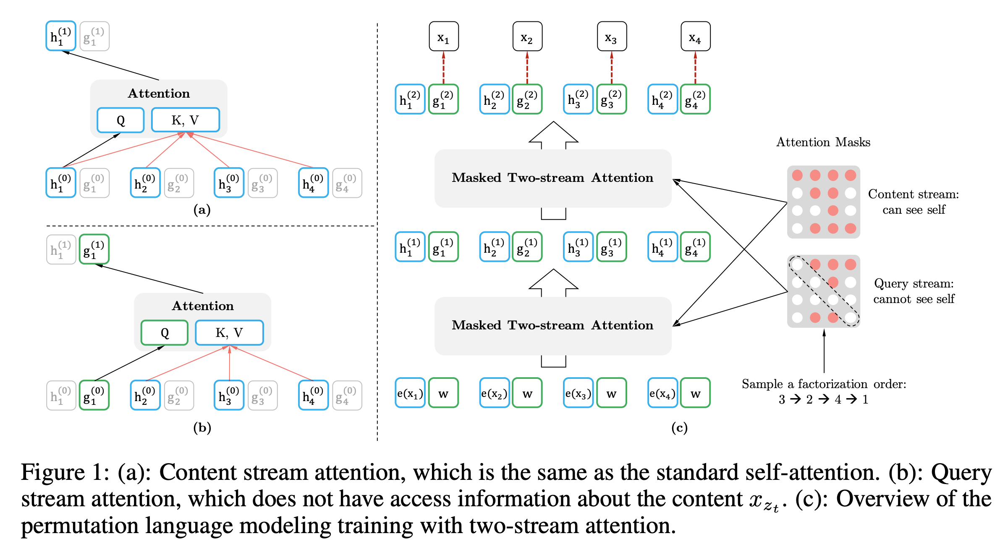

## XLNet: Generalized Autoregressive Pretraining for Language Understanding
### Zhilin Yang, Zihang Dai, Yiming Yang, Jaime Carbonell, Ruslan Salakhutdinov, Quoc V. Le
### Google AI Brain, 2019

* BERT is AE (autoencoding) language modeling with the objective of denoising the corrupted input. 
* BERT leverage bidirectional context but neglects dependency between masked positions, and hence there is a pre-train and fine tune discrepancy. 
* Autoregressive models does not have such limitations, but typically they are unidirectional.
* XLNet merges pros of AE language modelling (i.e. bidirectional context) at the same time in an AR (auto-regressive) fashion, so it does not suffer from neglecting dependencies between masked tokens.
* Inorder to have AR nature and simulataneously leverage bidirectional context, XLNet proposes permutation language modelling objecitve, where it maximizes expected likelihood of language model over all permutations.
* Mathematically, formulations are as below:
    * Autoregressive Language Models:
    
        

        * x_t depends on context learnt from x_1:t-1

    * BERT: AutoEncoder Denoising Language Models:

        

        * x_hat is corrupted sentence by maksing tokens
        * x_bar are masked tokens, only those tokens are to be predicted.
        * m_t is boolean flag if its a masked token

    * XLNET:
        * XLNET objective is to maximize expected likelihood over all permutations of input text

            

            * Over different permutation z, it predicts t-th word given all prior words in that permutation. And, ofcourse, since positional information is jumbled up in permuation, prediction and context both should be position aware:

            

            * where g is context representation, where:
                * it should have access to positions and content for all prior tokens
                * it should have access to target position without accessing content of target postion

            * Two stream attention:
                * Content representation: h_z_t - it is similar to transformer.
                * Query representation: g_z_t - contextual information of x_z<t, and positon z_t.

                *  For each self attention layer, m = 1,...,M, the two streams of attentions is computed as follow:

                    

                * In successive transformers layer, g_z_t can only see target position, but content as well as postions for prior context, because g_i^(0) is initiatlized as w, where as h_i^(0) is initialized as e(x_i).

            * Partial prediction, since its convergence is very slow, it only does prediction of last few tokens in a factorization order.   

            * Following plot explains two stream self attentio for target aware representation

                

    * Overall, XLNet performs much better than BERT and Roberta. But its training time and cost is huge. It takes around 5 times more computational complexity than BERT. Training cost of XLNet is estimated between $200K to $500K. 

        

